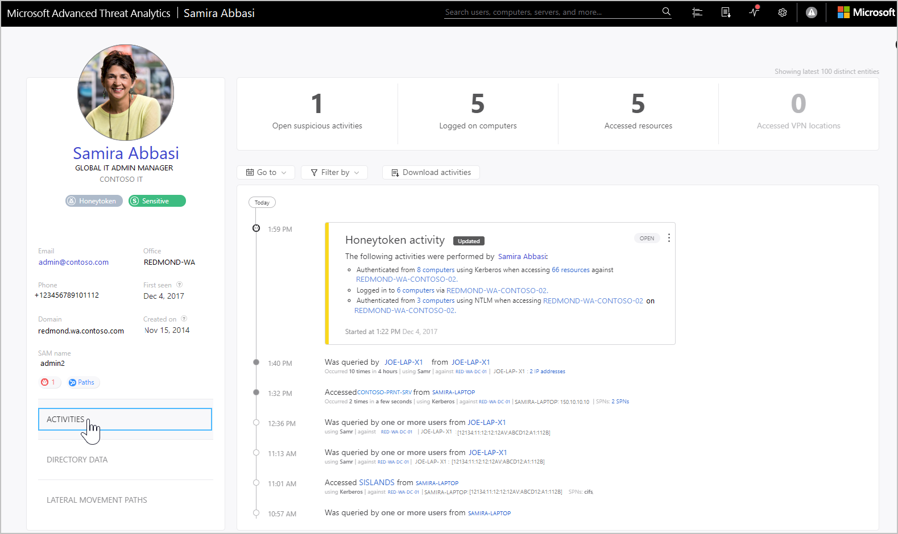
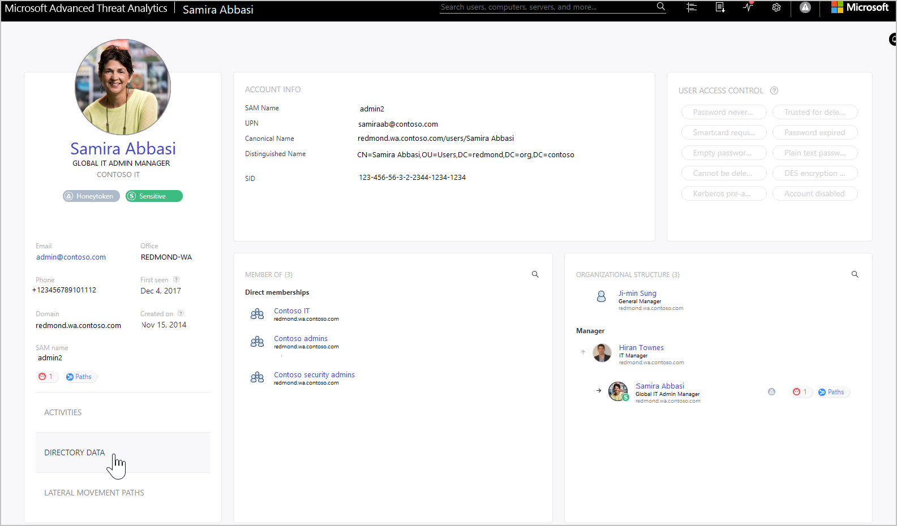

---
# required metadata

title: Working with entity profiles in the Advanced Threat Analytics console
description: Describes how to investigate entities from the user profiles screen in the ATA console
keywords:
author: dcurwin
ms.author: dacurwin
manager: dcurwin
ms.date: 01/10/2023
ms.topic: conceptual
ms.service: advanced-threat-analytics
ms.technology:
ms.assetid: 581a3257-32dc-453f-b84e-b9f99186f5d3

# optional metadata

#ROBOTS:
#audience:
#ms.devlang:
ms.reviewer: bennyl
ms.suite: ems
#ms.tgt_pltfrm:
#ms.custom:

---

# Investigating entity profiles

[!INCLUDE [Banner for top of topics](includes/banner.md)]

The entity profile provides you with a dashboard designed for full deep-dive investigation of users, computers, devices and the resources they have access to and their history. The profile page takes advantage of the new ATA logical activity translator which can look at a group of activities occurring (aggregated up to a minute) and group them into a single logical activity to give you a better understanding of the actual activities of your users.

To access an entity profile page, click on the name of the entity, such as a username, in the suspicious activity timeline.

The left menu provides you with all the Active Directory information available on the entity - email address, domain, first seen date. If the entity is sensitive it will tell you why. For example, is the user tagged as sensitive or the member of a sensitive group?
If it's a sensitive user you'll see the icon under the user's name.

## View entity activities

To view all the activities performed by the user, or performed on an entity, click on the **Activities** tab. 

 

By default, the main pane of the entity profile displays a timeline of the entity's activities with a history of up to 6 months back, from which you can also drill down into the entities accessed by the user, or for entities, users who accessed the entity.

At the top, you can view the summary tiles that give you a quick overview of what you need to understand in a glance about your entity. These tiles change based on what type of entity it is, for a user, you will see:
- How many open suspicious activities there are for the user
- How many computers the user logged onto
- How many resources the user accessed
- From which locations the user logged into VPN

  

For computers you can see:
- How many open suspicious activities there are for the machine
- How many users logged into the machine
- How many resources the computer accessed
- How many locations VPN was accessed from on the computer
- A list of which IP addresses the computer has used
  
  

Using the **Filter by** button above the activity timeline, you can filter the activities by activity type. You can also filter out a specific (noisy) type of activity. This is really helpful for investigation when you want to understand the basics of what an entity is doing in the network. You can also go to a specific date, and you can export the activities as filtered to Excel. The exported file provides a page for directory services changes (things that changed in Active Directory for the account) and a separate page for activities. 

## View directory data

The **Directory data** tab provides the static information available from Active Directory, including user access control security flags. ATA also displays group memberships for the user so that you can tell if the user has a direct membership or a recursive membership. For groups, ATA lists members of the group.

 

In the **User access control** section, ATA surfaces security settings that may need your attentions. You can see important flags about the user, such as can the user press enter to bypass the password, does the user have a password that never expires, etc. 

## View lateral movement paths

By clicking the **Lateral movement paths** tab you can view a fully dynamic and clickable map that provides you with a visual representation of the lateral movement paths to and from this user that can be used to infiltrate your network.

The map provides you with a list of how many hops between computers or users an attacker would have to and from this user to compromise a sensitive account, and if the user themselves has a sensitive account, you can see how many resources and accounts are directly connected. For more information, see [Lateral movement paths](use-case-lateral-movement-path.md). 

 

## See Also
[Check out the ATA forum!](https://social.technet.microsoft.com/Forums/security/home?forum=mata)
      
