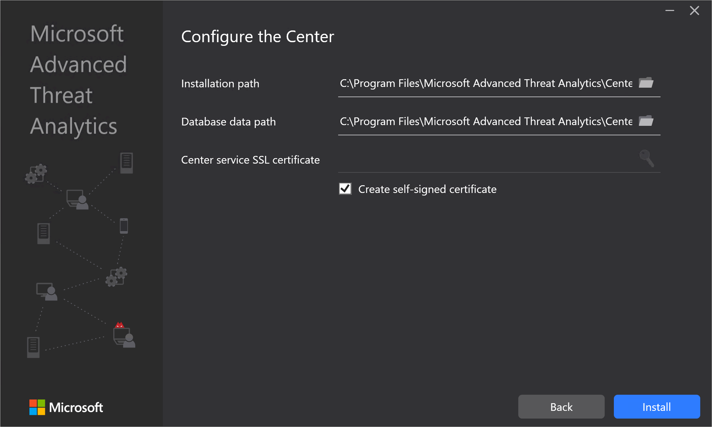

---
# required metadata

title: Install Advanced Threat Analytics - Step 1
description: First step to install ATA involves downloading and installing the ATA Center onto your chosen server.
keywords:
author: shsagir
ms.author: shsagir
manager: shsagir
ms.date: 03/07/2019
ms.topic: conceptual
ms.prod: advanced-threat-analytics
ms.technology:
ms.assetid: b3cceb18-0f3c-42ac-8630-bdc6b310f1d6

# optional metadata

#ROBOTS:
#audience:
#ms.devlang:
ms.reviewer: bennyl
ms.suite: ems
#ms.tgt_pltfrm:
#ms.custom:

---

# Install ATA - Step 1

[!INCLUDE [Banner for top of topics](includes/banner.md)]

> [!NOTE]
> **Support lifecycle**
>
> The final release of ATA is [generally available](https://support.microsoft.com/help/4568997/update-3-for-microsoft-advanced-threat-analytics-1-9). ATA will end Mainstream Support on January 12, 2021. Extended Support will continue until January 2026. For more information, read [our blog](https://techcommunity.microsoft.com/t5/microsoft-security-and/end-of-mainstream-support-for-advanced-threat-analytics-january/ba-p/1539181).

> [!div class="step-by-step"]
> [Step 2 »](install-ata-step2.md)

This installation procedure provides instructions for performing a fresh installation of ATA 1.9. For information on updating an existing ATA deployment from an earlier version, see [the ATA migration guide for version 1.9](ata-update-1.9-migration-guide.md).

> [!IMPORTANT]
> If using Windows 2012 R2, you can install KB2934520 on the ATA Center server and on the ATA Gateway servers before beginning installation, otherwise the ATA installation installs this update and requires a restart in the middle of the ATA installation.

## Step 1. Download and Install the ATA Center

After you have verified that the server meets the requirements, you can proceed with the installation of the ATA Center.

> [!NOTE]
> If you acquired a license for Enterprise Mobility + Security (EMS) directly via the Microsoft 365 portal or through the Cloud Solution Partner (CSP) licensing model and you do not have access to ATA through the Microsoft Volume Licensing Center (VLSC), contact Microsoft Customer Support to obtain the process to activate Advanced Threat Analytics (ATA).

Perform the following steps on the ATA Center server.

1. Download ATA from the [Microsoft Volume Licensing Service Center](https://www.microsoft.com/Licensing/servicecenter/default.aspx) or from the [TechNet Evaluation Center](https://www.microsoft.com/evalcenter/) or from [MSDN](/powerapps/developer/common-data-service/org-service/subscribe-sdk-assembly-updates-using-nuget).

1. Log in to the computer on to which you are installing the ATA Center as a user who is a member of the local administrators group.

1. Run **Microsoft ATA Center Setup.EXE** and follow the setup wizard.

    > [!NOTE]
    > Make sure to run the installation file from a local drive and not from a mounted ISO file to avoid issues in case a reboot is required as part of the installation.

1. If Microsoft .NET Framework is not installed, you are prompted to install it when you start installation. You may be prompted to reboot after .NET Framework installation.
1. On the **Welcome** page, select the language to be used for the ATA installation screens and click **Next**.

1. Read the Microsoft Software License Terms, after accepting the terms, click the acceptance check box, then click **Next**.

1. We recommend setting ATA to update automatically. If Windows isn't set to update automatically on your computer, you'll see the **Use Microsoft Update to help keep your computer secure and up to date** screen.
    

1. Select **Use Microsoft Update when I check for updates (recommended)**. This adjusts the Windows settings to enable updates for other Microsoft products (including ATA).

    

1. On the **Configure the Center** page, enter the following information based on your environment:

    |Field|Description|Comments|
    |---------|---------------|------------|
    |Installation Path|This is the location where the ATA Center is installed. By default this is %programfiles%\Microsoft Advanced Threat Analytics\Center|Leave the default value|
    |Database Data Path|This is the location where the MongoDB database files are located. By default this is %programfiles%\Microsoft Advanced Threat Analytics\Center\MongoDB\bin\data|Change the location to a place where you have room to grow based on your sizing. **Note:** <ul><li>In production environments, you should use a drive that has enough space based on capacity planning.</li><li>For large deployments the database should be on a separate physical disk.</li></ul>See [ATA capacity planning](ata-capacity-planning.md) for sizing information.|
    |Center Service SSL Certificate|This is the certificate that is used by the ATA Console and ATA Center service.|Click the key icon to select an installed certificate or use the checkbox to create a self-signed certificate.|

    

    > [!NOTE]
    > Make sure to pay attention to health alerts regarding the Center Service SSL Certificate status and expiration warnings. If the certificate expires, you'll need to completely re-deploy ATA.

1. Click **Install** to install the ATA Center and its components.  
The following components are installed and configured during the installation of ATA Center:

    - ATA Center service

    - MongoDB

    - Custom Performance Monitor data collection set

    - Self-signed certificates (if selected during the installation)

1. When the installation is complete, click **Launch**  to open the ATA Console and complete setup from the **Configuration** page.
    The **General** settings page will open automatically to continue the configuration and the deployment of the ATA Gateways.
    Because you are logging into the site using an IP address, you receive a warning related to the certificate, this is normal and you should click **Continue to this website**.

### Validate installation

1. Check if the service **Microsoft Advanced Threat Analytics Center**, is running.
1. On the desktop, click the **Microsoft Advanced Threat Analytics** shortcut to connect to the ATA Console. Log in with the user credentials you used to install the ATA Center.

### Set anti-virus exclusions

After installing the ATA Center, exclude the MongoDB database directory from being continuously scanned by your anti-virus application. The default location in the database is: **C:\Program Files\Microsoft Advanced Threat Analytics\Center\MongoDB\bin\data**.

Make sure to also exclude the following folders and processes from AV scanning:

**Folders**  
C:\Program Files\Microsoft Advanced Threat Analytics\Center\ParentKerberosAsBloomFilters  
C:\Program Files\Microsoft Advanced Threat Analytics\Center\ParentKerberosTgsBloomFilters  
C:\Program Files\Microsoft Advanced Threat Analytics\Center\Backup  
C:\Program Files\Microsoft Advanced Threat Analytics\Center\Logs

**Processes**  
mongod.exe  
Microsoft.Tri.Center.exe

If you installed ATA in different directory, make sure to change the folder paths according to your installation.

> [!div class="step-by-step"]
> [« Pre-install](configure-port-mirroring.md)
> [Step 2 »](install-ata-step2.md)

## Related Videos

- [Choosing the right ATA Gateway type](https://channel9.msdn.com/Shows/Microsoft-Security/ATA-Deployment-Choose-the-Right-Gateway-Type)
- [ATA Deployment Overview](https://channel9.msdn.com/Shows/Microsoft-Security/Overview-of-ATA-Deployment-in-10-Minutes)

## See Also

- [ATA POC deployment guide](https://aka.ms/atapoc)
- [ATA sizing tool](https://aka.ms/atasizingtool)
- [Check out the ATA forum!](https://social.technet.microsoft.com/Forums/security/home?forum=mata)
- [Configure event collection](configure-event-collection.md)
- [ATA prerequisites](ata-prerequisites.md)