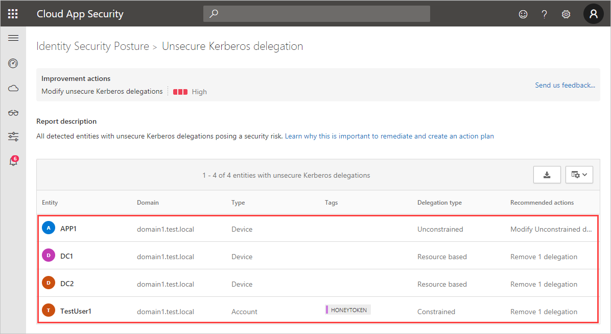
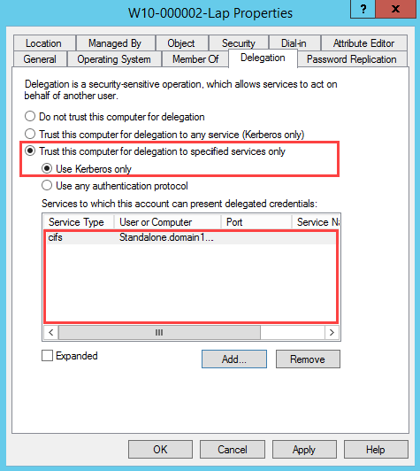
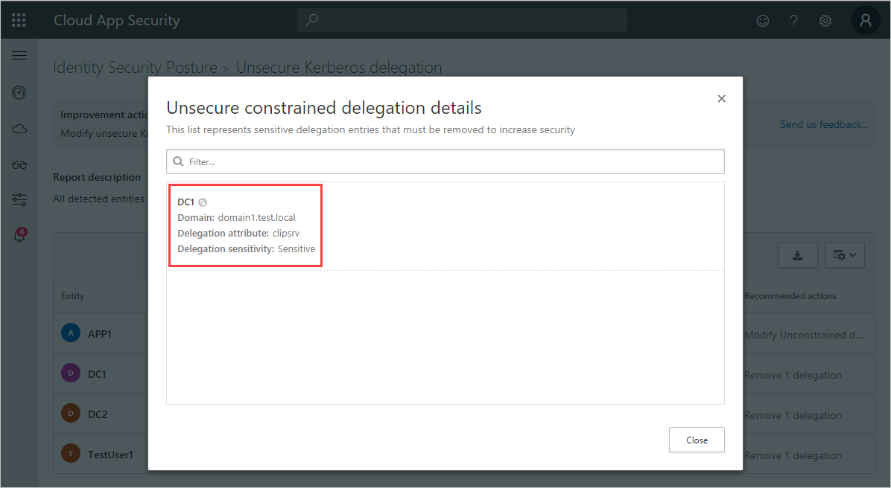

---
# required metadata

title: Azure Advanced Threat Protection unconstrained Kerberos identity security posture assessment
description: This article provides an overview of Azure ATP's unconstrained Kerberos identity security posture assessment reports.
keywords:
author: shsagir
ms.author: shsagir
manager: shsagir
ms.date: 09/15/2019
ms.topic: how-to
ms.collection: M365-security-compliance
ms.service: azure-advanced-threat-protection
ms.assetid: 7eea354b-7a50-40d9-bfa7-dcccaef23179

# optional metadata

#ROBOTS:
#audience:
#ms.devlang:
ms.reviewer: itargoet
ms.suite: ems
#ms.tgt_pltfrm:
#ms.custom:

---

# Security assessment: Unsecure Kerberos delegation

## What is Kerberos delegation?

Kerberos delegation is a delegation setting that allows applications to request end-user access credentials to access resources on behalf of the originating user.

## What risk does unsecure Kerberos delegation pose to an organization?

Unsecure Kerberos delegation gives an entity the ability to impersonate you to any other chosen service. For example, imagine you have an IIS website, and the application pool account is configured with unconstrained delegation. The IIS website site also has Windows Authentication enabled, allowing native Kerberos authentication, and the site uses a back-end SQL Server for business data. With your Domain Admin account, you browse to the IIS website and authenticate to it. The website, using unconstrained delegation is able to get a service ticket from a domain controller to the SQL service, and do so in your name.

The main issue with Kerberos delegation is that you need to trust the application to always do the right thing. Malicious actors can instead force the application to do the wrong thing. If you are logged on as **domain admin**, the site is able to create a ticket to whatever other service it wishes, acting as you, the **domain admin**. For example, the site could chose a domain controller, and make changes to the **enterprise admin** group. Similarly, the site could acquire the hash of the KRBTGT account, or download an interesting file from your Human Resources department. The risk is clear and the possibilities with unsecure delegation are nearly endless.

The following is a description of the risk posed by different delegation types:

- **Unconstrained delegation**: Any service can be abused if one of their delegation entries is sensitive.
- **Constrained delegation**: Constrained entities can be abused if one of their delegation entries is sensitive.
- **Resource-based constrained delegation (RBCD)**: Resource-based constrained entities can be abused if the entity itself is sensitive.

## How do I use this security assessment?

1. Use the report table to discover which of your non-domain controller entities are configured for **unsecure Kerberos delegation**.

    
1. Take appropriate action on those at-risk users, such as removing their unconstrained attribute or changing it to a more secure constrained delegation.

## Remediation

Use the remediation appropriate to your delegation type.

### Unconstrained delegation

Either disable delegation or use one of the following Kerberos constrained delegation (KCD) types:

- **Constrained delegation:** Restricts which services this account can impersonate.

    1. Select **Trust this computer for delegation to specified services only**.

        

    2. Specify the **Services to which this account can present delegated credentials**.

- **Resource-based constrained delegation:** Restricts which entities can impersonate this account.  
Resource-based KCD is configured using PowerShell. You use the [Set-ADComputer](/powershell/module/addsadministration/set-adcomputer?view=win10-ps) or [Set-ADUser](/powershell/module/addsadministration/set-aduser?view=win10-ps) cmdlets, depending on whether the impersonating account is a computer account or a user account / service account.

### Constrained delegation

Review the sensitive users listed in the recommendations and remove them from the services to which the affected account can present delegated credentials.

### Resource-based constrained delegation (RBCD)

Review the sensitive users listed in the recommendations and remove them from the resource. For more information about configuring RBCD, see [Configure Kerberos constrained delegation (KCD) in Azure Active Directory Domain Services](/azure/active-directory-domain-services/deploy-kcd).

## Next steps

- [Azure ATP activities filtering in Cloud App Security](atp-activities-filtering-mcas.md)
- [Check out the Azure ATP forum!](https://aka.ms/azureatpcommunity)
