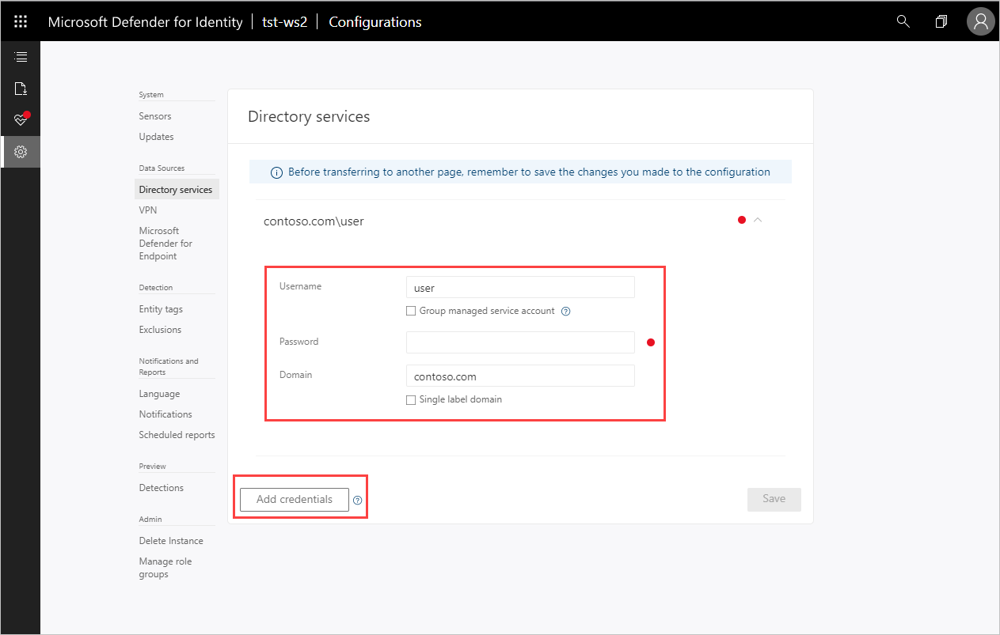

---
# required metadata

title: Azure Advanced Threat Protection multi-forest support
description: Support for multiple Active Directory forests in Azure ATP.
keywords:
author: shsagir
ms.author: shsagir
manager: shsagir
ms.date: 02/13/2020
ms.topic: conceptual
ms.collection: M365-security-compliance
ms.service: azure-advanced-threat-protection
ms.assetid: effca0f2-fcae-4fca-92c1-c37306decf84

# optional metadata

#ROBOTS:
#audience:
#ms.devlang:
ms.reviewer: itargoet
ms.suite: ems
#ms.tgt_pltfrm:
#ms.custom:

---

# Azure Advanced Threat Protection multi-forest support

## Multi-forest support set up

Azure ATP supports organizations with multiple forests, giving you the ability to easily monitor activity and profile users across forests.

Enterprise organizations typically have several Active Directory forests - often used for different purposes, including legacy infrastructure from corporate mergers and acquisitions, geographical distribution, and security boundaries (red-forests). You can protect multiple forests using Azure ATP, providing you with the ability to monitor and investigate your entire network through a single pane of glass.

The ability to support multiple Active Directory forests enables the following:

- View and investigate activities performed by users across multiple forests, from a single pane of glass.
- Improved detection and reduced false positives by providing advanced Active Directory integration and account resolution.
- Greater control and easier deployment. Improved health alerts and reporting for cross-org coverage when your domain controllers are all monitored from a single Azure ATP console.

## Azure ATP detection activity across multiple forests

To detect cross-forest activities, Azure ATP sensors query domain controllers in remote forests to create profiles for all entities involved, (including users and computers from remote forests).

- Azure ATP sensors can be installed on domain controllers in all forests, even forests with no trust.
- Add additional credentials on the Directory services page to support any untrusted forests in your environment.
    - Only one credential is required to support all forests with a two-way trust.
    - Additional credentials are only required for each forest with non-Kerberos trust or no trust.
    - There is a default limit of 10 untrusted forests per Azure ATP instance. Contact support if your organization has more than 10 forests.

### Requirements

- The user you configure in the Azure ATP console under **Directory services** must be trusted in all the other forests and must have at least read-only permission to perform LDAP queries on the domain controllers.
- If Azure ATP standalone sensors are installed on standalone machines, rather than directly on the domain controllers, make sure the machines are allowed to communicate with all of remote forest domain controllers using LDAP.

- In order for Azure ATP to communicate with the Azure ATP sensors and Azure ATP standalone sensors, open the following ports on each machine on which the Azure ATP sensor is installed:

  |Protocol|Transport|Port|To/From|Direction|
  |----|----|----|----|----|
  |**Internet ports**||||
  |SSL (*.atp.azure.com)|TCP|443|Azure ATP cloud service|Outbound|
  |**Internal ports**||||
  |LDAP|TCP and UDP|389|Domain controllers|Outbound|
  |Secure LDAP (LDAPS)|TCP|636|Domain controllers|Outbound|
  |LDAP to Global Catalog|TCP|3268|Domain controllers|Outbound|
  |LDAPS to Global Catalog|TCP|3269|Domain controllers|Outbound|

## Multi-forest support network traffic impact

When Azure ATP maps your forests, it uses a process that impacts the following:

- After the Azure ATP sensor is running, it queries the remote Active Directory forests and retrieves a list of users and machine data for profile creation.
- Every 5 minutes, each Azure ATP sensor queries one domain controller from each domain, from each forest, to map all the forests in the network.
- Each Azure ATP sensor maps the forests using the “trustedDomain” object in Active Directory, by logging in and checking the trust type.
- You may also see ad-hoc traffic when the Azure ATP sensor detects cross forest activity. When this occurs, the Azure ATP sensors will send an LDAP query to the relevant domain controllers in order to retrieve entity information.

## Known limitations

- Interactive logons performed by users in one forest to access resources in another forest are not displayed in the Azure ATP dashboard.

## See Also

- [Azure ATP sizing tool](https://aka.ms/aatpsizingtool)
- [Azure ATP architecture](atp-architecture.md)
- [Install Azure ATP](install-atp-step1.md)
- [Check out the Azure ATP forum!](https://aka.ms/azureatpcommunity)
