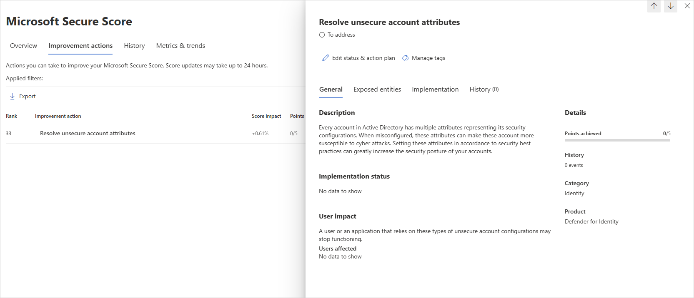

# Security assessment: Unsecure account attributes

## What are unsecure account attributes?

[!INCLUDE [Product long](includes/product-long.md)] continuously monitors your environment to identify accounts with attribute values that expose a security risk, and reports on these accounts to assist you in protecting your environment.

## What risk do unsecure account attributes pose?

Organizations that fail to secure their account attributes leave the door unlocked for malicious actors.

Malicious actors, much like thieves, often look for the easiest and quietest way into any environment. Accounts configured with unsecure attributes are windows of opportunity for attackers and can expose risks.

For example, if the attribute *PasswordNotRequired* is enabled, an attacker can easy access to the account. This is especially risky if the account has privileged access to other resources.

## How do I use this security assessment?

1. Use the report table to discover which of your accounts have unsecure attributes.
    
1. Take appropriate action on those user accounts by modifying or removing the relevant attributes.

> [!NOTE]
>
> - This assessment is updated in near real time.
> - This assessment might contain previously deleted entities if the [prerequisites](prerequisites.md#before-you-start) for [!INCLUDE [Product long](includes/product-long.md)] are not met.

## Remediation

Use the remediation appropriate to the relevant attribute as described in the following table.

| Recommended action | Remediation | Reason |
| --- | --- | --- |
| Remove Do not require Kerberos preauthentication| Remove this setting from account properties in Active Directory (AD) | Removing this setting requires a Kerberos pre-authentication for the account resulting in improved security. |
| Remove Store password using reversible encryption | Remove this setting from account properties in AD | Removing this setting prevents easy decryption of the account's password. |
| Remove Password not required | Remove this setting from account properties in AD | Removing this setting requires a password to be used with the account and helps prevent unauthorized access to resources. |
| Remove Password stored with weak encryption | Reset the account password | Changing the account's password enables stronger encryption algorithms to be used for its protection. |
| Enable Kerberos AES encryption support | Enable AES features on the account properties in AD | Enabling AES128_CTS_HMAC_SHA1_96 or AES256_CTS_HMAC_SHA1_96 on the account helps prevent the use of weaker encryption ciphers for Kerberos authentication. |
| Remove Use Kerberos DES encryption types for this account | Remove this setting from account properties in AD | Removing this setting enables the use of stronger encryption algorithms for the account's password. |

## See Also

- [[!INCLUDE [Product short](includes/product-short.md)] activities filtering in Defender for Cloud Apps](activities-filtering-mcas.md)
- [Check out the [!INCLUDE [Product short](includes/product-short.md)] forum!](<https://aka.ms/MDIcommunity>)
