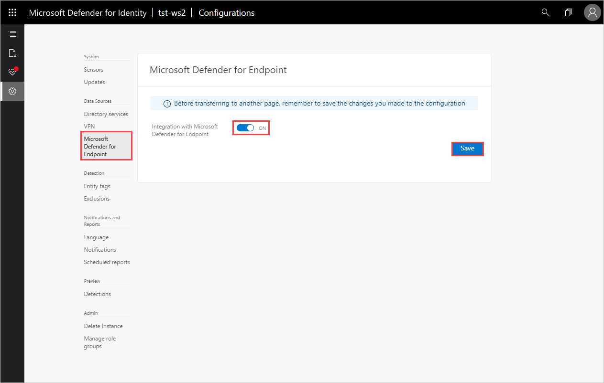
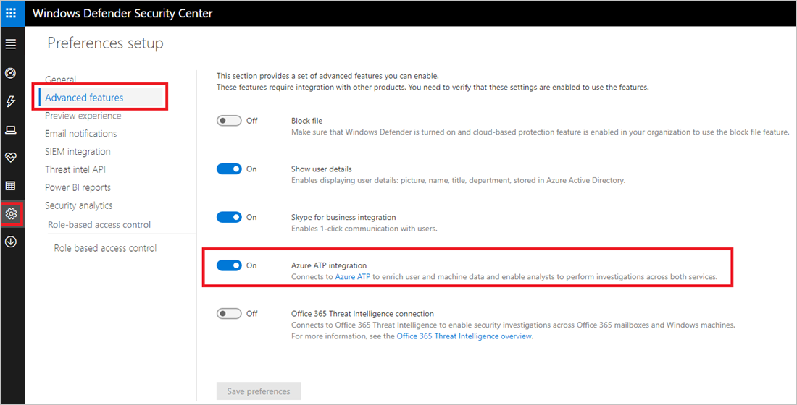
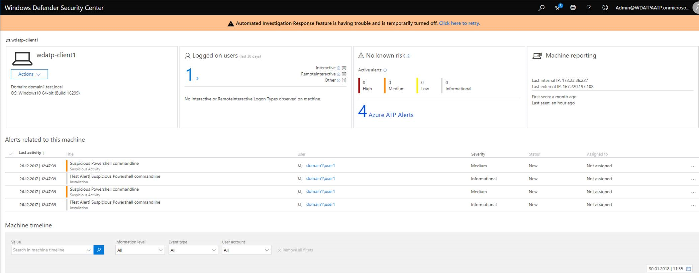

# Classic portal: Integrate Microsoft Defender for Identity with Microsoft Defender for Endpoint

[!INCLUDE [Product long](includes/product-long.md)] enables you to integrate [!INCLUDE [Product long](includes/product-long.md)] with Defender for Endpoint, for an even more complete threat protection solution. While [!INCLUDE [Product short](includes/product-short.md)] monitors the traffic on your domain controllers, Defender for Endpoint monitors your endpoints, together providing a single interface from which you can protect your environment.

By integrating Defender for Endpoint into [!INCLUDE [Product short](includes/product-short.md)], you can leverage the full power of both services and secure your environment, including:

- Endpoint behavioral sensors: Embedded in Windows 10, these sensors collect and process behavioral signals from the operating system (for example, process, registry, file, and network communications) and send this sensor data to your private, isolated, cloud instance of Defender for Endpoint.

- Cloud security analytics: Leveraging big-data, machine-learning, and unique Microsoft view across the Windows ecosystem (such as the [Microsoft Malicious Software Removal Tool](https://www.microsoft.com/download/malicious-software-removal-tool-details.aspx)), enterprise cloud products (such as Microsoft 365), and online assets (such as Bing and SmartScreen URL reputation), behavioral signals are translated into insights, detections, and recommended responses to advanced threats.

- Threat intelligence: Generated by Microsoft hunters, security teams, and augmented by threat intelligence provided by partners, threat intelligence enables Defender for Endpoint to identify attacker tools, techniques, procedures, and generate alerts when these activities are observed in collected sensor data.

[!INCLUDE [Product short](includes/product-short.md)] technology detects multiple suspicious activities, focusing on several phases of the cyber-attack kill chain including:

- Reconnaissance, during which attackers gather information on how the environment is built, what the different assets are, and which entities exist. They generally build their plan for the next phases of the attack here.

- Lateral movement cycle, during which an attacker invests time and effort in spreading their attack surface inside your network.

- Domain dominance (persistence), during which an attacker captures the information allowing them to resume their campaign using various sets of entry points, credentials, and techniques.

At the same time, Defender for Endpoint leverages Microsoft technology and expertise to detect sophisticated cyber-attacks, providing:

- Behavior-based, cloud-powered, advanced attack detection  
Finds the attacks that made it past all other defenses (post-breach detection), provides actionable, correlated alerts for known and unknown adversaries trying to hide their activities on endpoints.

- Rich timeline for forensic investigation and mitigation  
Easily investigate the scope of breach or suspected behaviors on any machine through a rich machine timeline. File, URLs, and network connection inventory across the network. Gain additional insight using deep collection and analysis ("detonation") for any file or URLs.

- Built-in unique threat intelligence knowledge base  
Unparalleled threat optics provides actor details and intent context for every threat intelligence based detection – combining first and third-party intelligence sources.

## Prerequisites

To enable this feature, you need a license for both [!INCLUDE [Product short](includes/product-short.md)] and Defender for Endpoint.

## How to integrate Defender for Identity with Defender for Endpoint

1. In the [!INCLUDE [Product short](includes/product-short.md)] portal, select **Configuration**.

    ] Configuration menu](media/msde-configuration.png)
1. In the Configurations list, select **Microsoft Defender for Endpoint** and set the integration toggle to **On**.

    

1. In the [Defender for Endpoint portal](https://securitycenter.windows.com/preferences/advanced), go to **Settings**, **Advanced features** and set **[!INCLUDE [Product long](includes/product-long.md)] integration** to **ON**.

    

1. To check the status of the integration, in the [!INCLUDE [Product short](includes/product-short.md)] portal, go to **Settings** > **Microsoft Defender for Endpoint integration**. You can see the status of the integration and if something is wrong, you'll see an error.

## How it works

After [!INCLUDE [Product short](includes/product-short.md)] and Defender for Endpoint are fully integrated, in the [!INCLUDE [Product short](includes/product-short.md)] portal, in the mini-profile pop-up and in the entity profile page, each entity that exists in Defender for Endpoint includes a badge to show that it is integrated with Defender for Endpoint.

If the entity contains alerts in Defender for Endpoint, there is a number next to the badge to let you know how many alerts were raised.

If you click on the badge, you are brought to the Defender for Endpoint portal where you can view and mitigate the alerts. If the entity is not recognized by Defender for Endpoint, the badge is grayed out.

 

From the Defender for Endpoint portal, click on an endpoint to view [!INCLUDE [Product short](includes/product-short.md)] alerts. If you click on the alerts for this entity in Defender for Endpoint, the entity's profile page opens in [!INCLUDE [Product short](includes/product-short.md)].

 > [!NOTE]
 > Currently, [!INCLUDE [Product short](includes/product-short.md)] integration with Defender for Endpoint supports only users and machines from the on-premises AD. Users from Azure AD and virtual machines that are managed in Azure will not be displayed as part of the integration

## See Also

- [Investigating lateral movement paths with [!INCLUDE [Product short](includes/product-short.md)]](use-case-lateral-movement-path.md)
- [[!INCLUDE [Product short](includes/product-short.md)] sizing tool](<https://aka.ms/mdi/sizingtool>)
- [[!INCLUDE [Product short](includes/product-short.md)] architecture](architecture.md)
- [Install [!INCLUDE [Product short](includes/product-short.md)]](install-step1.md)
- [Check out the [!INCLUDE [Product short](includes/product-short.md)] forum!](<https://aka.ms/MDIcommunity>)
