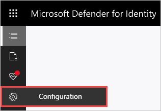

# Classic portal: Change Microsoft Defender for Identity portal configuration - domain connectivity password

## Change the domain connectivity password

If you need to modify the Domain Connectivity Password, make sure that the password you enter is correct. If it is not, the Microsoft Defender for Identity sensor service stops for all deployed sensors.

If you suspect that this happened, look at the Microsoft.Tri.sensor-Errors.log file for the following errors: `The supplied credential is invalid.`

Follow this procedure to update the Domain Connectivity password on the Defender for Identity portal:

> [!NOTE]
> This is the user name and password from the Active Directory on-premises deployment and not from Azure AD.

1. Open the Defender for Identity portal by accessing the portal URL.

1. Select the settings option on the toolbar and select **Configuration**.

    

1. Select **Directory Services**.

    

1. Under **Password**, change the password.

    > [!NOTE]
    > Enter an Active Directory user and password here, not Azure Active Directory.

1. Click **Save**.

1. In the Defender for Identity portal, select **Configuration**.
1. Under **System**, select **Sensors** page and check the status of the sensors.

## See Also

- [Integration with Microsoft Defender for Endpoint](classic-integrate-mde.md)
- [Check out the Defender for Identity forum!](<https://aka.ms/MDIcommunity>)
