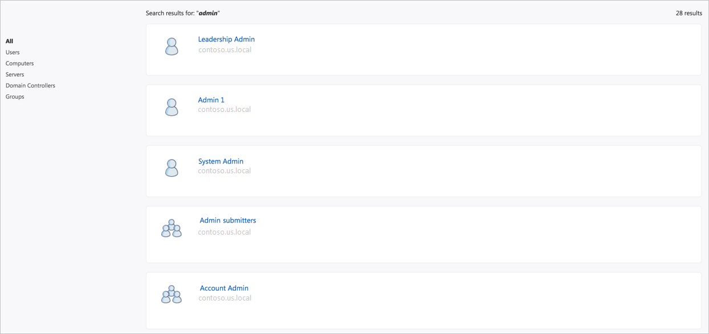

# Classic portal: Working with the Microsoft Defender for Identity portal

> [!NOTE]
> The experience described in this page can also be accessed at <https://security.microsoft.com> as part of Microsoft 365 Defender.

Use the [!INCLUDE [Product long](includes/product-long.md)] portal to monitor and respond to suspicious activity detected by [!INCLUDE [Product short](includes/product-short.md)].

Typing the `?` key provides keyboard shortcuts for [!INCLUDE [Product short](includes/product-short.md)] portal accessibility.

The [!INCLUDE [Product short](includes/product-short.md)] portal provides a quick view of all suspicious activities in chronological order. It enables you to drill into details of any activity and perform actions based on those activities. The [!INCLUDE [Product short](includes/product-short.md)] portal also displays alerts and notifications to highlight problems seen by [!INCLUDE [Product short](includes/product-short.md)] or new activities that are deemed suspicious.

This article describes how to work with the key elements of the [!INCLUDE [Product short](includes/product-short.md)] portal.

## Enabling access to the Defender for Identity portal

To successfully log in to the [!INCLUDE [Product short](includes/product-short.md)] portal, you have to log in with a user assigned to an Azure Active Directory security group with access to the [!INCLUDE [Product short](includes/product-short.md)] portal.
For more information about role-based access control (RBAC) in [!INCLUDE [Product short](includes/product-short.md)], see [Working with [!INCLUDE [Product short](includes/product-short.md)] role groups](role-groups.md).

## Logging into the Defender for Identity portal

1. You can enter the [!INCLUDE [Product short](includes/product-short.md)] portal either by logging in to the portal [https://portal.atp.azure.com](https://portal.atp.azure.com) and selecting your instance, or browsing to the instance URL: `https://*instancename*.atp.azure.com`.

1. [!INCLUDE [Product short](includes/product-short.md)] supports single sign-on integrated with Windows authentication - if you've already logged on to your computer, [!INCLUDE [Product short](includes/product-short.md)] uses that token to log you into the [!INCLUDE [Product short](includes/product-short.md)] portal. You can also log in using a smartcard. Your permissions in [!INCLUDE [Product short](includes/product-short.md)] correspond with your [administrator role](role-groups.md).

   > [!NOTE]
   > Make sure to log on to the computer from which you want to access the [!INCLUDE [Product short](includes/product-short.md)] portal using your [!INCLUDE [Product short](includes/product-short.md)] admin username and password. Alternatively, run your browser as a different user or log out of Windows and log on with your [!INCLUDE [Product short](includes/product-short.md)] admin user. Unlike the [!INCLUDE [Product short](includes/product-short.md)] portal, the new [Defender for Cloud Apps portal](https://portal.cloudappsecurity.com) offers multi-user login and requires no additional license to use with [!INCLUDE [Product short](includes/product-short.md)].

### Attack time line

The Attack time line is the default landing page you are taken to when you log in to the [!INCLUDE [Product short](includes/product-short.md)] portal. By default, all open suspicious activities are shown on the attack time line. You can filter the attack time line to show All, Open, Dismissed or Suppressed suspicious activities. You can also see the severity assigned to each activity.

] attack timeline image](media/sa-timeline.png)

For more information, see [Working with security alerts](working-with-suspicious-activities.md).

### What's new

After a new version of [!INCLUDE [Product short](includes/product-short.md)] is released, the **What's new** window appears in the top right to let you know what was added in the latest version. It also provides you with a link to the version download.

### Filtering panel

You can filter which suspicious activities are displayed in the attack time line or displayed in the entity profile suspicious activities tab based on Status and Severity.

### Search bar

In the top menu, you can find a search bar. You can search for a specific user, computer, or groups in [!INCLUDE [Product short](includes/product-short.md)]. To give it a try, just start typing. At the bottom of the search bar, the number of search results found is indicated.

] portal search image](media/workspace-portal-search.png)

If you click the number, you can access the search results page in which you can filter results by entity type for further investigation.

### Health center

The Health center provides you with alerts when something isn't working properly in your [!INCLUDE [Product short](includes/product-short.md)] instance.

] health center image](media/health-issue.png)

Any time your system encounters a problem, such as a connectivity error or a disconnected [!INCLUDE [Product short](includes/product-short.md)] standalone sensor, the Health Center icon lets you know by displaying a red dot.

] health center red dot image](media/health-bar.png)

### Sensitive groups

For information on sensitive groups in [!INCLUDE [Product short](includes/product-short.md)], see [Working with sensitive groups](manage-sensitive-honeytoken-accounts.md).

### Mini profile

If you hover your mouse over an entity, anywhere in the [!INCLUDE [Product short](includes/product-short.md)] portal where there is a single entity presented, such as a user, or a computer, a mini profile automatically opens displaying the following information, if available and relevant:

] mini profile image](media/mini-profile.png)

- Name
- Title
- Department
- AD tags
- Email
- Office
- Phone number
- Domain
- SAM name
- Created on – When the entity was created in the Active Directory. If was created before [!INCLUDE [Product short](includes/product-short.md)] started monitoring, it will not be displayed.
- First seen – The first time [!INCLUDE [Product short](includes/product-short.md)] observed an activity from this entity.
- Last seen - The last time [!INCLUDE [Product short](includes/product-short.md)] observed an activity from this entity.
- SA badge - Is displayed if there are suspicious activities associated with this entity.
- WD ATP badge- Will be displayed if there are suspicious activities in Microsoft Defender for Endpoint associated with this entity.
- Lateral movement paths badge - Will be displayed if there have been lateral movement paths detected for this entity within the last two days.

## See Also

- [Creating [!INCLUDE [Product short](includes/product-short.md)] instances](install-step1.md)
- [Check out the [!INCLUDE [Product short](includes/product-short.md)] forum!](<https://aka.ms/MDIcommunity>)
