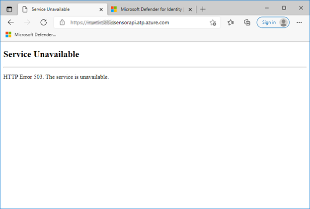
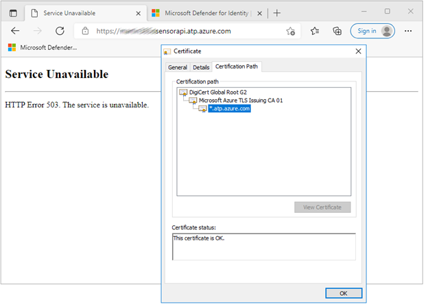

# Configure endpoint proxy and Internet connectivity settings for your Microsoft Defender for Identity sensor

Each [!INCLUDE [Product long](includes/product-long.md)] sensor requires Internet connectivity to the [!INCLUDE [Product short](includes/product-short.md)] cloud service to report sensor data and operate successfully. In some organizations, the domain controllers aren't directly connected to the internet, but are connected through a web proxy connection.

We recommend using the command line to configure your proxy server as doing so ensures that only the [!INCLUDE [Product short](includes/product-short.md)] sensor services communicate through the proxy.

## Configure proxy server using the command line

You can configure your proxy server during sensor installation using the following command-line switches.

### Syntax

"Azure ATP sensor Setup.exe" [/quiet] [/Help] [ProxyUrl="http://proxy.internal.com"] [ProxyUserName="domain\proxyuser"] [ProxyUserPassword="ProxyPassword"]

### Switch descriptions

> [!div class="mx-tableFixed"]
>
> |Name|Syntax|Mandatory for silent installation?|Description|
> |-------------|----------|---------|---------|
> |ProxyUrl|ProxyUrl="http\://proxy.contoso.com:8080"|No|Specifies the ProxyUrl and port number for the [!INCLUDE [Product short](includes/product-short.md)] sensor.|
> |ProxyUserName|ProxyUserName="Contoso\ProxyUser"|No|If your proxy service requires authentication, supply a user name in the DOMAIN\user format.|
> |ProxyUserPassword|ProxyUserPassword="P@ssw0rd"|No|Specifies the password for proxy user name. *Credentials are encrypted and stored locally by the [!INCLUDE [Product short](includes/product-short.md)] sensor.|

## Alternative methods to configure your proxy server

You can use one of the following alternative methods to configure your proxy server. When configuring the proxy settings using these methods, other services running in the context as Local System or Local Service will also direct traffic through the proxy.

- [Configure proxy server using WinINet](#configure-proxy-server-using-wininet)
- [Configure proxy server using the registry](#configure-proxy-server-using-the-registry)

### Configure proxy server using WinINet

You can configure your proxy server using Microsoft Windows Internet (WinINet) proxy configuration, to allow [!INCLUDE [Product short](includes/product-short.md)] sensor to report diagnostic data and communicate with [!INCLUDE [Product short](includes/product-short.md)] cloud service when a computer isn't permitted to connect to the Internet. If you use WinHTTP for proxy configuration, you still need to configure Windows Internet (WinINet) browser proxy settings for communication between the sensor and the [!INCLUDE [Product short](includes/product-short.md)] cloud service.

When configuring the proxy, remember that the embedded [!INCLUDE [Product short](includes/product-short.md)] sensor service runs in system context using the **LocalService** account, and that the [!INCLUDE [Product short](includes/product-short.md)] Sensor Updater service runs in the system context using **LocalSystem** account.

> [!NOTE]
> If you're using Transparent proxy or WPAD in your network topology, you don't need to configure WinINet for your proxy.

### Configure proxy server using the registry

You can also configure your proxy server manually using a registry-based static proxy, to allow [!INCLUDE [Product short](includes/product-short.md)] sensor to report diagnostic data and communicate with [!INCLUDE [Product short](includes/product-short.md)] cloud service when a computer isn't permitted to connect to the Internet.

> [!NOTE]
> The registry changes should be applied only to LocalService and LocalSystem.

The static proxy is configurable through the Registry. You must copy the proxy configuration that you use in user context to the LocalSystem and LocalService. To copy your user context proxy settings:

1. Make sure to back up the registry keys before you modify them.

1. In the registry, search for the value `DefaultConnectionSettings` as REG_BINARY under the registry key `HKCU\Software\Microsoft\Windows\CurrentVersion\Internet Settings\Connections\DefaultConnectionSettings` and copy it.

1. If the LocalSystem doesn't have the correct proxy settings (either they aren't configured or they're different from the Current_User), then copy the proxy setting from the Current_User to the LocalSystem. Under the registry key `HKU\S-1-5-18\Software\Microsoft\Windows\CurrentVersion\Internet Settings\Connections\DefaultConnectionSettings`.

1. Paste the value from the Current_user `DefaultConnectionSettings` as REG_BINARY.

1. If the LocalService doesn't have the correct proxy settings, then copy the proxy setting from the Current_User to the LocalService. Under the registry key `HKU\S-1-5-19\Software\Microsoft\Windows\CurrentVersion\Internet Settings\Connections\DefaultConnectionSettings`.

1. Paste the value from the Current_User `DefaultConnectionSettings` as REG_BINARY.

> [!NOTE]
> This will affect all applications including Windows services which use WinINET with LocalService, LocalSytem context.

## Enable access to Defender for Identity service URLs in the proxy server

To enable access to [!INCLUDE [Product short](includes/product-short.md)], we recommend allowing traffic to the following URLs. The URLs automatically map to the correct service location for your [!INCLUDE [Product short](includes/product-short.md)] instance.

- `<your-instance-name>.atp.azure.com` – for console connectivity. For example, `contoso-corp.atp.azure.com`

- `<your-instance-name>sensorapi.atp.azure.com` – for sensors connectivity. For example, `contoso-corpsensorapi.atp.azure.com`

You can also use the IP address ranges in our Azure service tag (**AzureAdvancedThreatProtection**) to enable access to [!INCLUDE [Product short](includes/product-short.md)]. For more information about service tags, see [Virtual network service tags](/azure/virtual-network/service-tags-overview).

If you would like to download the "Azure IP Ranges and Service Tags - Public Cloud" file, you can do so [here](https://www.microsoft.com/download/details.aspx?id=56519). For US Government offerings, see [Get started with US Government offerings](us-govt-gcc-high.md).

> [!NOTE]
>
> - To ensure maximal security and data privacy, [!INCLUDE [Product short](includes/product-short.md)] uses certificate based mutual authentication between each [!INCLUDE [Product short](includes/product-short.md)] sensor and the [!INCLUDE [Product short](includes/product-short.md)] cloud backend. If SSL inspection is used in your environment, make sure that the inspection is configured for mutual authentication so it does not interfere in the authentication process.
> - Occasionally, the [!INCLUDE [Product short](includes/product-short.md)] service IP addresses may change. Therefore, if you manually configure IP addresses or if your proxy automatically resolves DNS names to their IP address and uses them, you should periodically check that the configured IP addresses are still up-to-date.

## Test proxy connectivity

The Defender for Identity sensor requires network connectivity to the Defender for Identity service running in Azure. Most organizations control access to the internet via firewall or proxies.  When using a proxy, you can allow access port 443 via a single URL. For more information about the ports that the Defender for Identity requires, see [Required ports](prerequisites.md#ports).

After the proxy has been configured to allow the sensor access to the Defender for Identity service, follow the steps below to confirm that everything is working as expected. This can be done:

- before you deploy the sensor
- if the sensor experiences connectivity issues after being installed

1. Open a browser using the same proxy settings being used by the sensor.

    >[!NOTE]
    >If the proxy settings are defined for **Local System**, you'll need to use PSExec to open a session as **Local System** and open the browser from that session.

1. Browse to the following URL: `https://<your_workspace_name>sensorapi.atp.azure.com.` Replace `<your_workspace_name>` with the name of your Defender for Identity workspace.

    >[!IMPORTANT]
    >You must specify HTTPS, not HTTP, to properly test connectivity.

1. **Result**: You should get an *Error 503 The service is unavailable*, which indicates you were successfully able to route to the Defender for Identity HTTPS endpoint.  This is the desired result.

    

1. If you don't get *Error 503 The service is unavailable*, then you may have a problem with your proxy configuration. Check your network and proxy settings.

1. If you get a certificate error, ensure that you have the required trusted root certificates installed before continuing. For more information, see [Proxy authentication problem presents as a connection error](troubleshooting-known-issues.md#proxy-authentication-problem-presents-as-a-connection-error). The certificate details should look like this:

    

## Next steps

- [Configure Microsoft Defender for Identity to make remote calls to SAM](remote-calls-sam.md)
