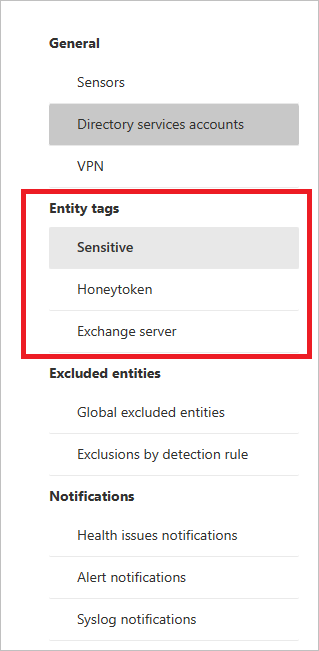
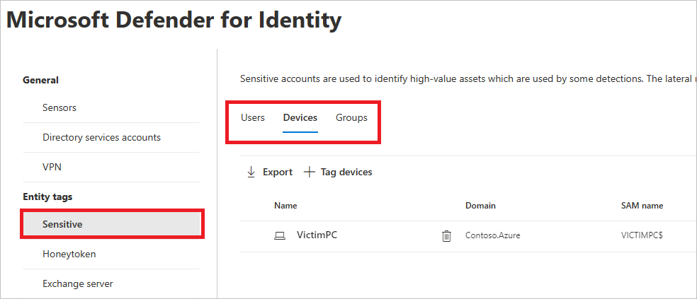
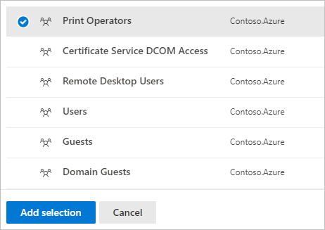
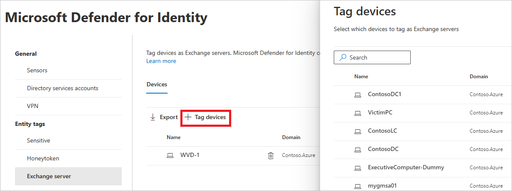
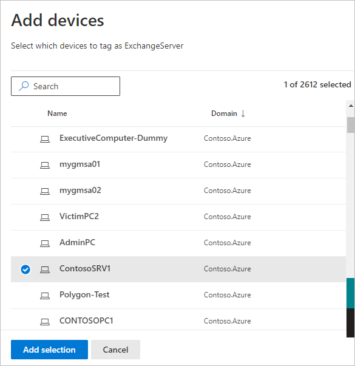

# Defender for Identity entity tags in Microsoft 365 Defender

> [!NOTE]
> The experience described in this page can be accessed at <https://security.microsoft.com> as part of Microsoft 365 Defender.

This article explains how to apply entity tags to sensitive accounts. This is important because some [!INCLUDE [Short long](includes/product-short.md)] detections, such as sensitive group modification detection and lateral movement path rely on an entity's sensitivity status.

[!INCLUDE [Product short](includes/product-short.md)] also enables the configuration of honeytoken accounts, which are used as traps for malicious actors - any authentication associated with these honeytoken accounts (normally dormant), triggers an alert.

## Entity tags

In Microsoft 365 Defender, you can set three types of Defender for Identity entity tags: **Sensitive tags**, **Honeytoken tags**, and **Exchange server tags**.

To set these tags, in [Microsoft 365 Defender](https://security.microsoft.com), go to **Settings** and then **Identities**.

The tag settings will appear under **Entity tags**.

To set each type of tag, follow the instructions below.

## Sensitive  tags

The **Sensitive tag** is used to identify high value assets. The lateral movement path also relies on an entity's sensitivity status. Some entities are considered sensitive automatically by Defender for Identity, and others can be added manually.

### Sensitive entities

The groups in the following list are considered **Sensitive** by [!INCLUDE [Short long](includes/product-short.md)]. Any entity that is a member of one of these Active Directory groups (including nested groups and their members) is automatically considered sensitive:

- Administrators
- Power Users
- Account Operators
- Server Operators
- Print Operators
- Backup Operators
- Replicators
- Network Configuration Operators
- Incoming Forest Trust Builders
- Domain Admins
- Domain Controllers
- Group Policy Creator Owners
- Read-only Domain Controllers
- Enterprise Read-only Domain Controllers
- Schema Admins
- Enterprise Admins
- Microsoft Exchange Servers

  > [!NOTE]
  > Until September 2018, Remote Desktop Users were also automatically considered sensitive by [!INCLUDE [Product short](includes/product-short.md)]. Remote Desktop entities or groups added after this date are no longer automatically marked as sensitive while Remote Desktop entities or groups added before this date may remain marked as Sensitive. This Sensitive setting can now be changed manually.

In addition to these groups, [!INCLUDE [Product short](includes/product-short.md)] identifies the following high value asset servers and automatically tags them as **Sensitive**:

- Certificate Authority Server
- DHCP Server
- DNS Server
- Microsoft Exchange Server

### Manually tag as sensitive

You can also manually tag users, devices, or groups as sensitive.

1. Select **Sensitive**. You'll then see the existing sensitive **Users**, **Devices**, and **Groups**.

    

1. Under each category, select **Tag...** to tag that type of entity. For example, under **Groups**, select **Tag groups.** A pane will open with the groups you can select to tag. To search for a group, enter its name in the search box.

    

1. Select your group, and select **Add selection.**

    

## Honeytoken tags

Honeytoken entities are used as traps for malicious actors. Any authentication associated with these honeytoken entities triggers an alert.

You can tag users or devices with the **Honeytoken** tag in the same way you tag sensitive accounts.

1. Select **Honeytoken**. You'll then see the existing honeytoken **Users** and **Devices**.

    

1. Under each category, select **Tag...** to tag that type of entity. For example, under **Users**, select **Tag users.** A pane will open with the groups you can select to tag. To search for a group, enter its name in the search box.

    

1. Select your user, and select **Add selection.**

    

## Exchange server tags

Defender for Identity considers Exchange servers as high-value assets and automatically tags them as **Sensitive**. You can also manually tag devices as Exchange servers.

1. Select **Exchange server**. You'll then see the existing devices labeled with the **Exchange server** tag.

    

1. To tag a device as an Exchange server, select **Tag devices**.  A pane will open with the devices that you can select to tag. To search for a device, enter its name in the search box.

    

1. Select your device, and select **Add selection.**

    

## See also

- [Working with suspicious activities](/defender-for-identity/manage-security-alerts)
- [Check out the [!INCLUDE [Product short](includes/product-short.md)] forum!](<https://aka.ms/MDIcommunity>)