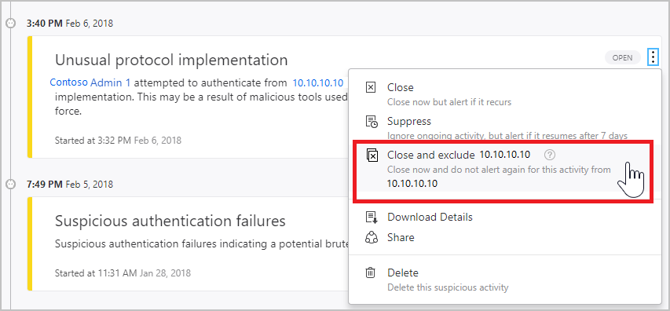

---
# required metadata

title: Excluding entities from detections in Azure Advanced Threat Protection
description: Describes how to stop Azure ATP from detecting specific entity activities as suspicious
keywords:
author: shsagir
ms.author: shsagir
manager: shsagir
ms.date: 11/11/2018
ms.topic: how-to
ms.collection: M365-security-compliance
ms.service: azure-advanced-threat-protection
ms.assetid: cae3ed45-8fbc-4f25-ba24-3cc407c6ea93

# optional metadata

#ROBOTS:
#audience:
#ms.devlang:
ms.reviewer: itargoet
ms.suite: ems
#ms.tgt_pltfrm:
#ms.custom:

---

# Excluding entities from detections

[!INCLUDE [Rebranding notice](includes/banner.md)]

This article explains how to exclude entities from triggering alerts. Certain entities are excluded to minimize true benign positives while making sure you can catch the true positives. In order to keep Azure ATP from creating noise about activities that, from specific users, may be part of your normal rhythm of business, you can quiet - or exclude - specific entities from raising alerts. In addition, certain popular entities are excluded by default. 

For example, if you have a security scanner that does DNS recon or an admin who remotely runs scripts on the domain controller - and these are sanctioned activities whose intent is part of the normal IT operation in your organization, these can be excluded. For more information about each Azure ATP detection to help you decide which entities to exclude, see the [Security Alert guide](suspicious-activity-guide.md).

## Entities excluded by default from raising alerts
 For certain alerts, such as **Suspicious communication over DNS**, automatic domain exclusions are added by Azure ATP based on customer feedback and research. 
 
 

## Exclude entities from raising alerts

There are two ways you can manually exclude entities, either directly from the security alert, or from the **Exclusions** tab on the **Configuration** page. 

- **From the security alert**: In the Activity timeline, when you receive an alert on an activity for a user, computer or IP address that **is** allowed to perform the particular activity, and may do so frequently, do the following:
  - Right-click the three dots at the end of the row for the security alert on that entity and select **Close and exclude**. This adds the user, computer, or IP address to the exclusions list for that security alert. It closes the security alert and the alert is no longer listed in the **Open** events list in the **Alert timeline**.

    

- **From the Configuration page**:  To review or modify any exclusions: under **Configuration**, click **Exclusions** and then select the security alert to apply the exclusion to, such as **DNS reconnaissance**.

    

To add an entity from the **Exclusions** configuration: enter the entity name, then click the plus, and then click **Save** at the bottom of the page.

To remove an entity from the **Exclusions** configuration: click the minus next to the entity name, then click **Save** at the bottom of the page.

It is recommended that you add exclusions to detections only after you get alerts of that specific type *and* determine that they are true benign positives. 

> [!NOTE]
> For your protection, not all detections provide the possibility to set exclusions. 

Some of the detections provide tips that help you decide what to exclude. 

Each exclusion depends on the context, in some you can set users while for others you can set computers or IP addresses. 

When you have the possibility of excluding an IP address or a computer, you can exclude one or the other - you don't need to provide both.

> [!NOTE]
> Configuration pages can be modified by Azure ATP admins only.

## See Also

- [Azure ATP Security Alert guide](suspicious-activity-guide.md)
- [Integrating with Microsoft Defender ATP](integrate-msde.md)
- [Check out the Azure ATP forum!](https://aka.ms/azureatpcommunity)
