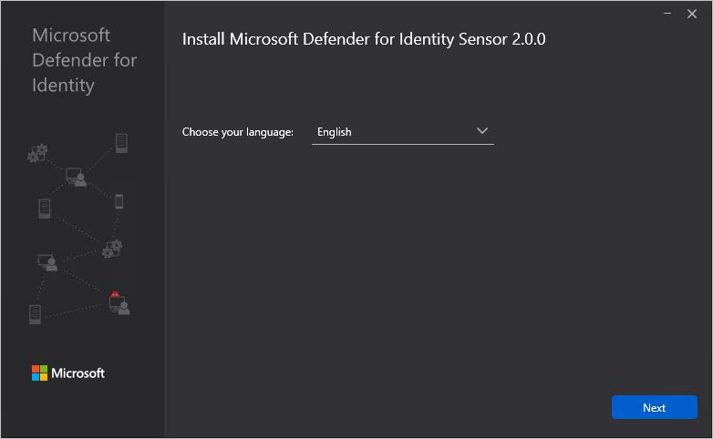
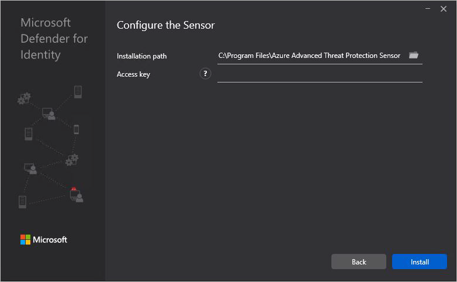

# Install the Microsoft Defender for Identity sensor

Learn how to install the Microsoft Defender for Identity sensor on domain controllers.

## Install the Defender for Identity sensor

### Prerequisites

- A downloaded copy of your [Defender for Identity sensor setup package](download-sensor.md) and the access key.
- Make sure Microsoft .NET Framework 4.7 or later is installed on the machine. If Microsoft .NET Framework 4.7 or later isn't installed, the Defender for Identity sensor setup package installs it, which may require a reboot of the server.
- For sensor installations on Active Directory Federation Services (AD FS) servers, see [AD FS Prerequisites](active-directory-federation-services.md#prerequisites).

>[!NOTE]
>When installing the sensor on Windows Server Core, or to deploy the sensor via a software deployment system, follow the steps for [silent installation](#defender-for-identity-sensor-silent-installation).

## Install the sensor

Perform the following steps on the domain controller or AD FS server.

1. Verify the machine has connectivity to the relevant [Defender for Identity cloud service](configure-proxy.md#enable-access-to-defender-for-identity-service-urls-in-the-proxy-server) endpoint(s).
1. Extract the installation files from the zip file. Installing directly from the zip file will fail.
1. Run **Azure ATP sensor setup.exe** with elevated privileges (**Run as administrator**) and follow the setup wizard.
1. On the **Welcome** page, select your language and select **Next**.

    

1. The installation wizard automatically checks if the server is a domain controller/ AD FS server or a dedicated server. If it's a domain controller / AD FS server, the Defender for Identity sensor is installed. If it's a dedicated server, the Defender for Identity standalone sensor is installed.

    For example, for a Defender for Identity sensor, the following screen is displayed to let you know that a Defender for Identity sensor is installed on your dedicated server:

    

    Select **Next**.

    > [!NOTE]
    > A warning is issued if the domain controller / AD FS server or dedicated server does not meet the minimum hardware requirements for the installation. The warning doesn't prevent you from clicking **Next**, and proceeding with the installation. It can still be the right option for the installation of Defender for Identity in a small lab test environment where less room for data storage is required. For production environments, it is highly recommended to work with Defender for Identity's [capacity planning](capacity-planning.md) guide to make sure your domain controllers or dedicated servers meet the necessary requirements.

1. Under **Configure the sensor**, enter the installation path and the access key that you copied from the previous step, based on your environment:

    

    - Installation path: The location where the Defender for Identity sensor is installed. By default the path is  `%programfiles%\Azure Advanced Threat Protection sensor`. Leave the default value.
    - Access key: Retrieved from the Microsoft 365 Defender portal in the previous step.

1. Select **Install**. The following components are installed and configured during the installation of the Defender for Identity sensor:

    - KB 3047154 (for Windows Server 2012 R2 only)

        > [!IMPORTANT]
        >
        > - Don't install KB 3047154 on a virtualization host (the host that is running the virtualization -  it's fine to run it on a virtual machine). This may cause port mirroring to stop working properly.
        > - If Wireshark is installed on the Defender for Identity sensor machine, after you run Wireshark you need to restart the Defender for Identity sensor, because it uses the same drivers.

    - Defender for Identity sensor service and Defender for Identity sensor updater service
    - Microsoft Visual C++ 2013 Redistributable

> [!NOTE]
> Beginning with version 2.176, when installing the sensor from a new package, the sensor's version under **Add/Remove Programs** will appear with the full version number (for example, 2.176.x.y), as opposed to the static 2.0.0.0 that was previously shown. It will continue to show that version (the one installed through the package) even though the version will be updated through the automatic updates from the Defender for Identity cloud services. The real version can be seen in the [sensor settings page](https://security.microsoft.com/settings/identities?tabid=sensor) in the portal, in the executable path or in the file version.

> [!NOTE]
> If you installed the sensor on AD FS servers, follow the steps in [Post-installation steps for AD FS servers](active-directory-federation-services.md#post-installation-steps-for-ad-fs-servers) to complete the setup. These steps are required, or the sensor services will not start.

## Defender for Identity sensor silent installation

Using Defender for Identity silent installation, the installer is configured to automatically restart the server at the end of the installation (if necessary). Make sure to run silent installation only during a maintenance window. Because of a Windows Installer bug, the *norestart* flag cannot be reliably used to make sure the server does not restart.

To track your deployment progress, monitor the Defender for Identity installer logs, which are located in `%AppData%\Local\Temp`.

> [!NOTE]
> When silently deploying the Defender for Identity sensor via System Center Configuration Manager or other software deployment system, it is recommended to create two deployment packages:</br>- Net Framework 4.7 or later which may include rebooting the domain controller</br>- Defender for Identity sensor. </br>Make the Defender for Identity sensor package dependent on the deployment of the .Net Framework package deployment. </br>Get the [.Net Framework 4.7 offline deployment package](https://support.microsoft.com/topic/the-net-framework-4-7-offline-installer-for-windows-f32bcb33-5f94-57ce-6120-62c9526a91f2).

Use the following command to perform a fully silent install of the Defender for Identity sensor:

**cmd.exe syntax**:

```cmd
"Azure ATP sensor Setup.exe" /quiet NetFrameworkCommandLineArguments="/q" AccessKey="<Access Key>"
```

**Powershell syntax**:

```powershell
.\"Azure ATP sensor Setup.exe" /quiet NetFrameworkCommandLineArguments="/q" AccessKey="<Access Key>"
```

> [!NOTE]
> When using the Powershell syntax, omitting the `.\` preface results in an error that prevents silent installation.

> [!NOTE]
> Copy the access key from the Microsoft 365 Defender portal **Identity** section, **Sensors** page, **+Add sensor** button.

**Installation options**:

> [!div class="mx-tableFixed"]
>
> |Name|Syntax|Mandatory for silent installation?|Description|
> |-------------|----------|---------|---------|
> |Quiet|/quiet|Yes|Runs the installer displaying no UI and no prompts.|
> |Help|/help|No|Provides help and quick reference. Displays the correct use of the setup command including a list of all options and behaviors.|
> |NetFrameworkCommandLineArguments="/q"|NetFrameworkCommandLineArguments="/q"|Yes|Specifies the parameters for the .Net Framework installation. Must be set to enforce the silent installation of .Net Framework.|

**Installation parameters**:

> [!div class="mx-tableFixed"]
>
> |Name|Syntax|Mandatory for silent installation?|Description|
> |-------------|----------|---------|---------|
> |InstallationPath|InstallationPath=""|No|Sets the path for the installation of Defender for Identity Sensor binaries. Default path: %programfiles%\Azure Advanced Threat Protection Sensor
> |AccessKey|AccessKey="\*\*"|Yes|Sets the access key that is used to register the Defender for Identity sensor with the Defender for Identity instance.|
> |DelayedUpdate|DelayedUpdate=true|No|Sets the sensor's update mechanism to delay the update for 72 hours from the official release of each service update. See [Delayed sensor update](sensor-settings.md#delayed-sensor-update) for more details.|
> |LogsPath|LogsPath=""|No|Sets the path for the Defender for Identity Sensor logs. Default path: %programfiles%\Azure Advanced Threat Protection Sensor|

**Examples**:

Use the following command to silently install the Defender for Identity sensor:

```cmd
"Azure ATP sensor Setup.exe" /quiet NetFrameworkCommandLineArguments="/q" AccessKey="mmAOkLYCzfH8L/zUIsH24BIJBevlAWu7wUcSfIkRJufpuEojaDHYdjrNs0P3zpD+/bObKfLS0puD7biT5KDf3g=="
```

## Post-installation steps for AD FS servers

If you installed the sensor on AD FS servers, follow the steps in [Post-installation steps for AD FS servers](active-directory-federation-services.md#post-installation-steps-for-ad-fs-servers).

## Next steps

> [!div class="step-by-step"]
> [« Proxy configuration](configure-proxy.md)
> [Manage action accounts »](manage-action-accounts.md)
