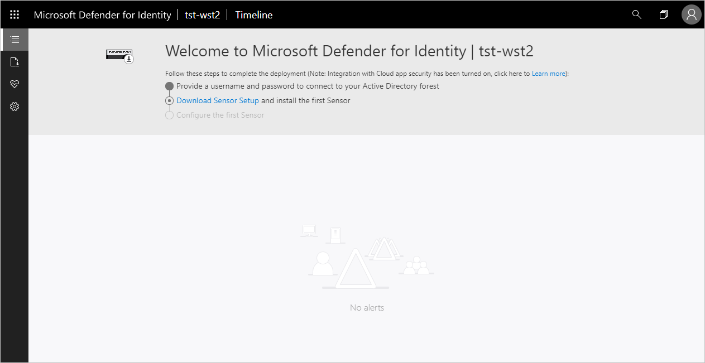
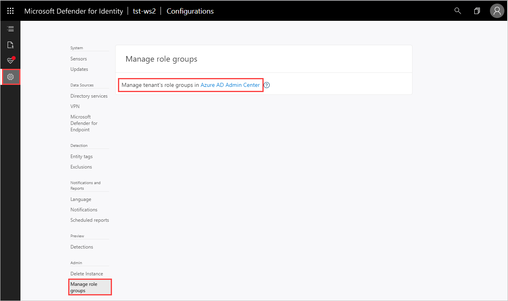

# Quickstart: Create your Microsoft Defender for Identity instance

In this quickstart, you'll create your [!INCLUDE [Product long](includes/product-long.md)] instance in the [!INCLUDE [Product short](includes/product-short.md)] portal. In [!INCLUDE [Product short](includes/product-short.md)], you'll have a single instance, previously called a workspace. A single instance enables you to manage multiple forests from a single pane of glass.

> [!IMPORTANT]
> Currently, [!INCLUDE [Product short](includes/product-short.md)] data centers are deployed in Europe, UK, North America/Central America/Caribbean and Asia. Your instance is created automatically in the data center that is geographically closest to your Azure Active Directory (Azure AD). Once created, [!INCLUDE [Product short](includes/product-short.md)] instances aren't movable.

## Prerequisites

- An [[!INCLUDE [Product long](includes/product-long.md)] license](technical-faq.yml#licensing-and-privacy).
- You need to be a [global administrator or security administrator on the tenant](/azure/active-directory/users-groups-roles/directory-assign-admin-roles#available-roles) to access the [!INCLUDE [Product short](includes/product-short.md)] portal.
- Review the [[!INCLUDE [Product short](includes/product-short.md)] architecture](architecture.md) article.
- Review the [[!INCLUDE [Product short](includes/product-short.md)] prerequisites](prerequisites.md) article.

## Sign in to the Defender for Identity portal

After you verified that your network meets the sensor requirements, start the creation of your [!INCLUDE [Product short](includes/product-short.md)] instance.

1. Go to [the [!INCLUDE [Product short](includes/product-short.md)] portal](https://portal.atp.azure.com)*.

1. Sign in with your Azure Active Directory user account.

\* GCC High customers must use the [[!INCLUDE [Product short](includes/product-short.md)] GCC High](http://portal.atp.azure.us) portal.

## Create your instance

1. Click **Create instance**.

    ] instance](media/create-instance.png)

1. Your [!INCLUDE [Product short](includes/product-short.md)] instance is automatically named with the Azure AD initial domain name and created in the data center located closest to your Azure AD.

    

    > [!NOTE]
    > To sign in to [!INCLUDE [Product short](includes/product-short.md)], you'll need to sign in with a user assigned a [!INCLUDE [Product short](includes/product-short.md)] role with rights to access the [!INCLUDE [Product short](includes/product-short.md)] portal. For more information about role-based access control (RBAC) in [!INCLUDE [Product short](includes/product-short.md)], see [Working with [!INCLUDE [Product short](includes/product-short.md)] role groups](role-groups.md).

1. Select **Configuration**, **Manage role groups**, and use the [Azure AD Admin Center](/azure/active-directory/active-directory-assign-admin-roles-azure-portal) link to manage your role groups.

    

- Data retention – previously deleted [!INCLUDE [Product short](includes/product-short.md)] instances don't appear in the UI. For more information on [!INCLUDE [Product short](includes/product-short.md)] data retention, see [[!INCLUDE [Product short](includes/product-short.md)] data security and privacy](privacy-compliance.md).

## Next steps

> [!div class="step-by-step"]
> [« Prerequisites](prerequisites.md)
> [Step 2 - Connect to Active Directory »](install-step2.md)

## Join the Community

Have more questions, or an interest in discussing [!INCLUDE [Product short](includes/product-short.md)] and related security with others? Join the [[!INCLUDE [Product short](includes/product-short.md)] Community](https://aka.ms/MDIcommunity) today!
