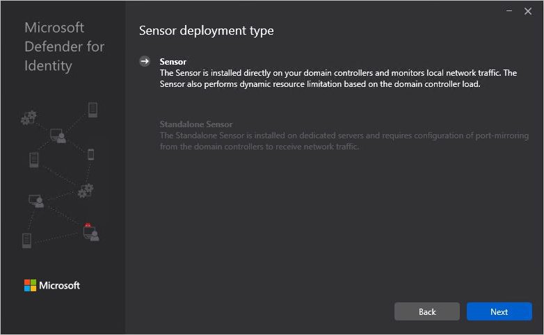

---
# required metadata

title: Install Azure ATP sensor quickstart
description: Step four of installing Azure ATP helps you to install the Azure ATP sensor.
author: shsagir
ms.author: shsagir
ms.date: 07/29/2020
ms.topic: quickstart
ms.collection: M365-security-compliance
ms.service: azure-advanced-threat-protection

# optional metadata

#ROBOTS:
#audience:
#ms.devlang:
ms.reviewer: itargoet
ms.suite: ems
#ms.tgt_pltfrm:
#ms.custom:

---

# Quickstart: Install the Azure ATP sensor

> [!IMPORTANT]
> Threat protection product names from Microsoft are changing. Read more about this and other updates [here](https://www.microsoft.com/security/blog/?p=91813).  We’ll be updating names in products and in the docs in the near future.

In this quickstart, you'll install the Azure ATP sensor on a domain controller. If you prefer a silent installation, see the [Silent installation](silent-installation.md) article.

## Prerequisites

- An [Azure ATP instance](install-step1.md) that's [connected to Active Directory](install-step2.md).
- A downloaded copy of your [ATP sensor setup package](install-step3.md) and the access key.
- Make sure Microsoft .Net Framework 4.7 or later is installed on the machine. If Microsoft .Net Framework 4.7 or later isn't installed, the Azure ATP sensor setup package installs it, which may require a reboot of the server.

## Install the sensor

Perform the following steps on the domain controller.

1. Verify the machine has connectivity to the relevant [Azure ATP cloud service](configure-proxy.md#enable-access-to-azure-atp-service-urls-in-the-proxy-server) endpoint(s):
1. Extract the installation files from the zip file. Installing directly from the zip file will fail.
1. Run **Azure ATP sensor setup.exe** and follow the setup wizard.
1. On the **Welcome** page, select your language and click **Next**.

    

1. The installation wizard automatically checks if the server is a domain controller or a dedicated server. If it's a domain controller, the Azure ATP sensor is installed. If it's a dedicated server, the Azure ATP standalone sensor is installed.

    For example, for an Azure ATP sensor, the following screen is displayed to let you know that an Azure ATP sensor is installed on your dedicated server:

    

    Click **Next**.

    > [!NOTE]
    > A warning is issued if the domain controller or dedicated server does not meet the minimum hardware requirements for the installation. The warning doesn't prevent you from clicking **Next**, and proceeding with the installation. It can still be the right option for the installation of Azure ATP in a small lab test environment where less room for data storage is required. For production environments, it is highly recommended to work with Azure ATP's [capacity planning](capacity-planning.md) guide to make sure your domain controllers or dedicated servers meet the necessary requirements.

1. Under **Configure the sensor**, enter the installation path and the access key that you copied from the previous step, based on your environment:

    

    - Installation path: The location where the Azure ATP sensor is installed. By default the path is  %programfiles%\Azure Advanced Threat Protection sensor. Leave the default value.
    - Access key: Retrieved from the Azure ATP portal in the previous step.

1. Click **Install**. The following components are installed and configured during the installation of the Azure ATP sensor:

    - KB 3047154 (for Windows Server 2012 R2 only)

        > [!IMPORTANT]
        >
        > - Do not install KB 3047154 on a virtualization host (the host that is running the virtualization, it is fine to run it on a virtual machine). This may cause port mirroring to stop working properly.
        > - If Wireshark is installed on the ATP sensor machine, after you run Wireshark you need to restart the ATP sensor, because it uses the same drivers.

    - Azure ATP sensor service and Azure ATP sensor updater service
    - Microsoft Visual C++ 2013 Redistributable

## Next steps

The Azure ATP sensor is designed to have minimal impact on your domain controller resources and network activity. To create a performance assessment, see [Plan capacity for Azure ATP](capacity-planning.md).

## Join the Community

Have more questions, or an interest in discussing Azure ATP and related security with others? Join the [Azure ATP Community](https://aka.ms/azureatpcommunity) today!
