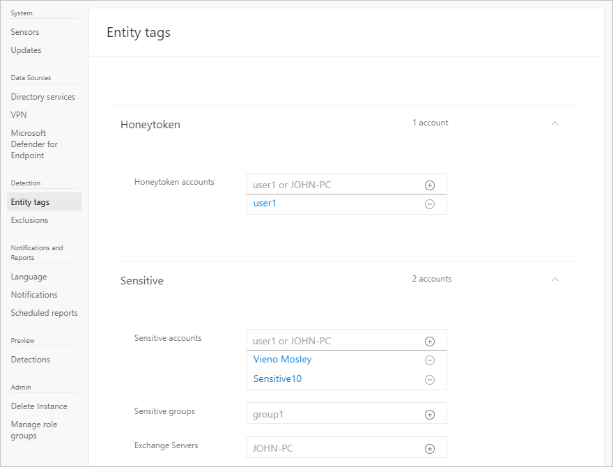

---
# required metadata

title: Azure Advanced Threat Protection configure detection exclusions and honeytoken accounts
description: Configuration of detection exclusions and honeytoken user accounts.
keywords:
author: shsagir
ms.author: shsagir
manager: shsagir
ms.date: 10/22/2019
ms.topic: how-to
ms.collection: M365-security-compliance
ms.service: azure-advanced-threat-protection
ms.assetid: 1ad5e923-9bbd-4f56-839a-b11a9f387d4b

# optional metadata

#ROBOTS:
#audience:
#ms.devlang:
ms.reviewer: itargoet
ms.suite: ems
#ms.tgt_pltfrm:
#ms.custom:

---

# Configure detection exclusions and honeytoken accounts

[!INCLUDE [Rebranding notice](includes/rebranding.md)]

Azure ATP enables the exclusion of specific IP addresses or users from a number of detections.

For example, a **DNS Reconnaissance exclusion** could be a security scanner that uses DNS as a scanning mechanism. The exclusion helps Azure ATP ignore such scanners.

Azure ATP also enables the configuration of honeytoken accounts, which are used as traps for malicious actors - any authentication associated with these honeytoken accounts (normally dormant), triggers an alert.

To configure, follow these steps:

1. From the Azure ATP portal, click on the settings icon and select **Configuration**.

    

1. Under **Detection**, click **Entity tags**.

1. Under **Honeytoken accounts**, enter the Honeytoken account name and click the **+** sign. The Honeytoken accounts field is searchable and automatically displays entities in your network. Click **Save**.

    

1. Click **Exclusions**. Enter a user account or IP address to be excluded from the detection, for each type of threat.
1. Click the *plus* sign. The **Add entity** (user or computer) field is searchable and will autofill with entities in your network. For more information, see [Excluding entities from detections](excluding-entities-from-detections.md) and the [security alert guide](suspicious-activity-guide.md).

    

1. Click **Save**.

Congratulations, you have successfully deployed Azure Advanced Threat Protection!

Check the attack timeline to view security alerts generated from detected activities and search for users or computers, and view their profiles.

Azure ATP scanning starts immediately. Some detections, such as [Suspicious additions to sensitive groups](domain-dominance-alerts.md#suspicious-additions-to-sensitive-groups-external-id-2024), require a learning period and aren't available immediately after Azure ATP deployment.The learning period for each alert is listed in the detailed [security alert guide](suspicious-activity-guide.md).

## See Also

- [Azure ATP sizing tool](https://aka.ms/aatpsizingtool)
- [Configure event collection](configure-event-collection.md)
- [Azure ATP prerequisites](prerequisites.md)
- [Check out the Azure ATP forum!](https://aka.ms/azureatpcommunity)
