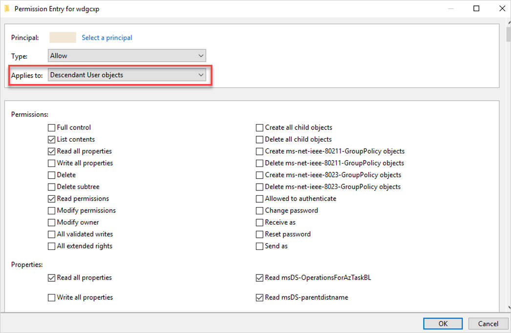
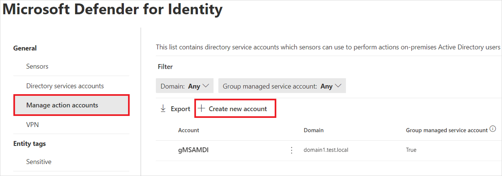

# Microsoft Defender for Identity action accounts

Defender for Identity now allows you to create action accounts. These accounts are used to allow you to take actions on users directly from Defender for Identity.

We recommend you create the gMSA account Defender for Identity will use to run the available [remediation actions](remediation-actions.md).

## Create and configure the action account

1. On a domain controller in your domain, create a new gMSA account, following the instructions in [Getting started with Group Managed Service Accounts](/windows-server/security/group-managed-service-accounts/getting-started-with-group-managed-service-accounts).
1. Assign the "Log on as a service" right to the gMSA account on each domain controller that runs the Defender for Identity sensor.

1. Grant the required permissions to the gMSA account.
    1. Open **Active Directory Users and Computers**.
    1. Right-click the relevant domain or OU, and select **Properties**.

        
    1. Go the **Security** tab and select **Advanced**.

        

    1. Select **Add**.
    1. Choose **Select a principal**.
        
    1. Make sure **Service accounts** is marked in **Object types**.
        
    1. Enter the name of the gMSA account in the **Enter the object name to select** box and select **OK**.
    1. Select **Descendant User objects** in the **Applies to** field and set the following permissions and properties:
        
        - To enable force password reset:
            - Permissions:
                - Reset password
            - Properties:
                - Read pwdLastSet
                - Write pwdLastSet
        - To disable user:
            - Properties:
                - Read userAccountControl
                - Write userAccountControl
    1. Select **Descendant Group objects** in the **Applies to** field and set the following properties:

        - Read members
        - Write members
    1. Select **OK**.

> [!NOTE]
> It's recommended to not use the same gMSA account you configured for Defender for Identity managed actions on servers other than domain controllers. If the server is compromised, an attacker could retrieve the password for the account and gain the ability to change passwords and disable accounts.

## Add the gMSA account in the Microsoft 365 Defender portal

1. Go to the [Microsoft 365 Defender portal](https://security.microsoft.com).
1. Go to **Settings** -> **Identities**.
1. Under **Microsoft Defender for Identity**, select **Manage action accounts**.
1. Select **+Create new account** to add your gMSA account.
1. Provide the account name and domain, and select **Save**.
1. Your action account will be listed on the **Manage action accounts** page.

      

## Next steps

- [Directory Service Account recommendations](directory-service-accounts.md)
- [Troubleshooting gMSA account issues](troubleshooting-known-issues.md#sensor-failed-to-retrieve-group-managed-service-account-gmsa-credentials)
