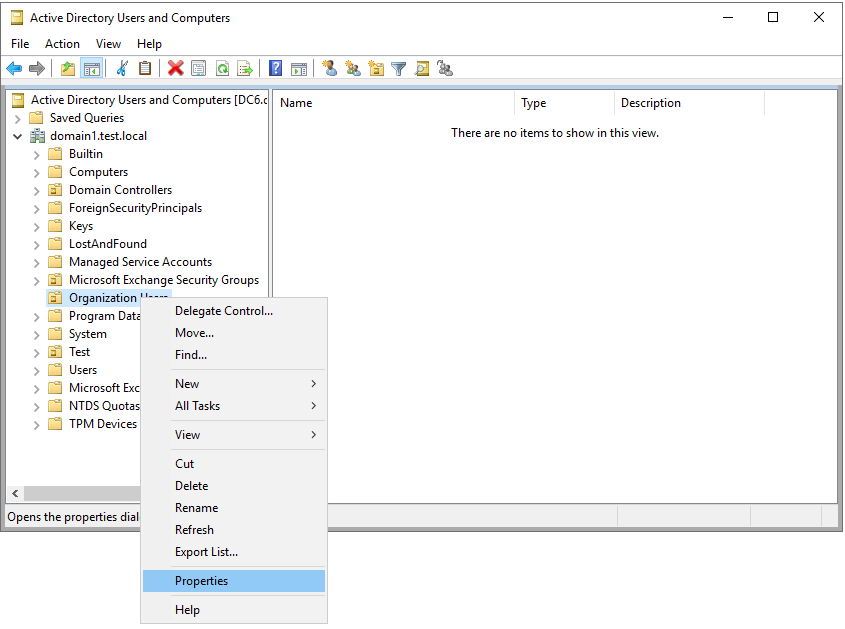
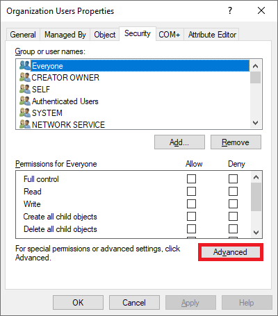
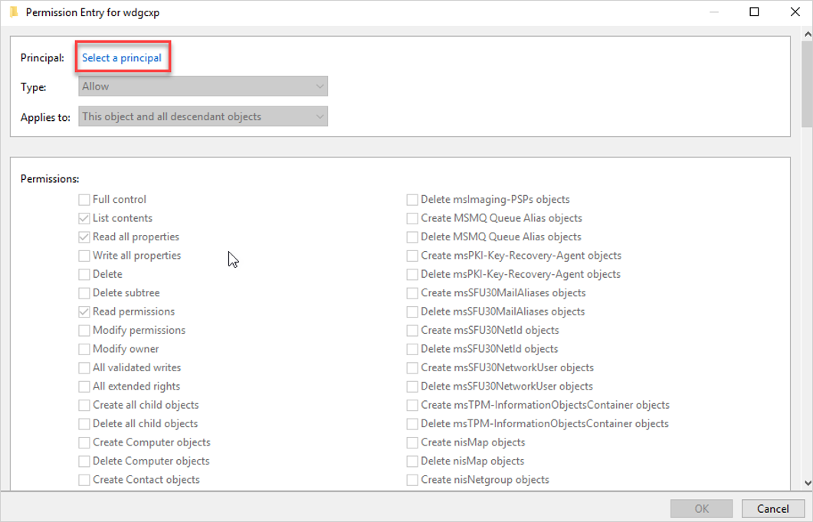
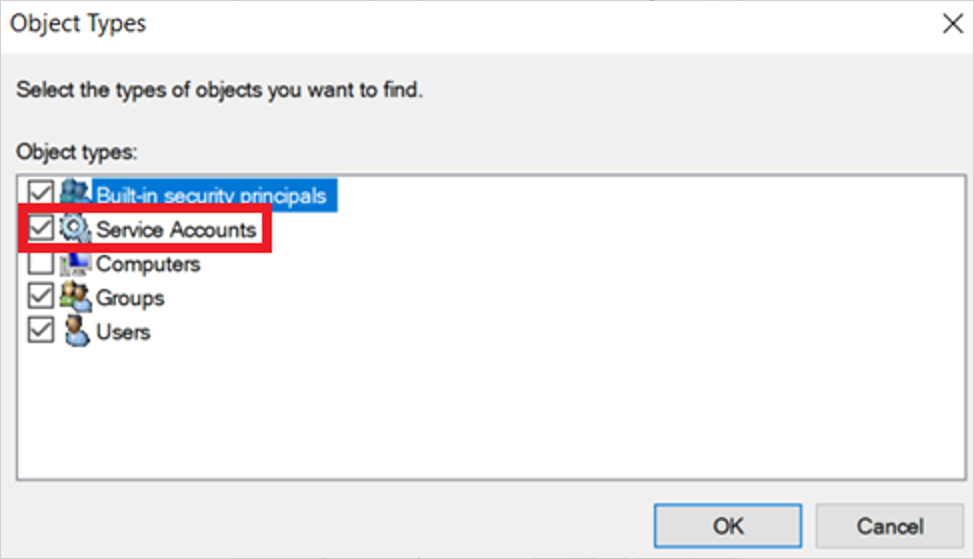

# Microsoft Defender for Identity action accounts

Defender for Identity allows you to take [remediation actions](remediation-actions.md) targeting on-premises Active Directory accounts in the event that an identity is compromised. To take these actions, Microsoft Defender for Identity needs to have the required permissions to do so.

By default, the Microsoft Defender for Identity sensor installed on a domain controller will impersonate the LocalSystem account of the domain controller and perform the actions. However, you can change this default behavior by setting up a gMSA account and scope the permissions as you need.

:::image type="content" source="media/management-accounts.png" alt-text="Configure management accounts.":::

## Create and configure a specific action account

1. On a domain controller in your domain, create a new gMSA account, following the instructions in [Getting started with Group Managed Service Accounts](/windows-server/security/group-managed-service-accounts/getting-started-with-group-managed-service-accounts).
1. Assign the "Log on as a service" right to the gMSA account on each domain controller that runs the Defender for Identity sensor.

1. Grant the required permissions to the gMSA account.
    1. Open **Active Directory Users and Computers**.
    1. Right-click the relevant domain or OU, and select **Properties**.

        
    1. Go the **Security** tab and select **Advanced**.

        

    1. Select **Add**.
    1. Choose **Select a principal**.
        
    1. Make sure **Service accounts** is marked in **Object types**.
        
    1. Enter the name of the gMSA account in the **Enter the object name to select** box and select **OK**.
    1. Select **Descendant User objects** in the **Applies to** field, leave the existing settings, and add the following permissions and properties:
        
        - To enable force password reset:
            - Permissions:
                - Reset password
            - Properties:
                - Read pwdLastSet
                - Write pwdLastSet
        - To disable user:
            - Properties:
                - Read userAccountControl
                - Write userAccountControl
    1. Select **Descendant Group objects** in the **Applies to** field and set the following properties:

        - Read members
        - Write members
    1. Select **OK**.

> [!NOTE]
>
> - It's not recommended to use the same gMSA account you configured for Defender for Identity managed actions on servers other than domain controllers. If the server is compromised, an attacker could retrieve the password for the account and gain the ability to change passwords and disable accounts.
>
> - We don't recommend using the same account as the Directory Service account and the Manage Action account. This is because the Directory Service account requires only read-only permissions to Active Directory, and the Manage Action accounts needs write permissions on user accounts.

## Add the gMSA account in the Microsoft 365 Defender portal

1. Go to the [Microsoft 365 Defender portal](https://security.microsoft.com).
1. Go to **Settings** -> **Identities**.
1. Under **Microsoft Defender for Identity**, select **Manage action accounts**.
1. Select **+Create new account** to add your gMSA account.
1. Provide the account name and domain, and select **Save**.
1. Your action account will be listed on the **Manage action accounts** page.

      

## Related videos

[Remediation actions in Defender for Identity](https://www.microsoft.com/videoplayer/embed/RE4U7Pe)

## Next steps

> [!div class="step-by-step"]
> [« Install the Defender for Identity sensor](install-sensor.md)
> [Configure the Defender for Identity sensor »](configure-sensor-settings.md)
