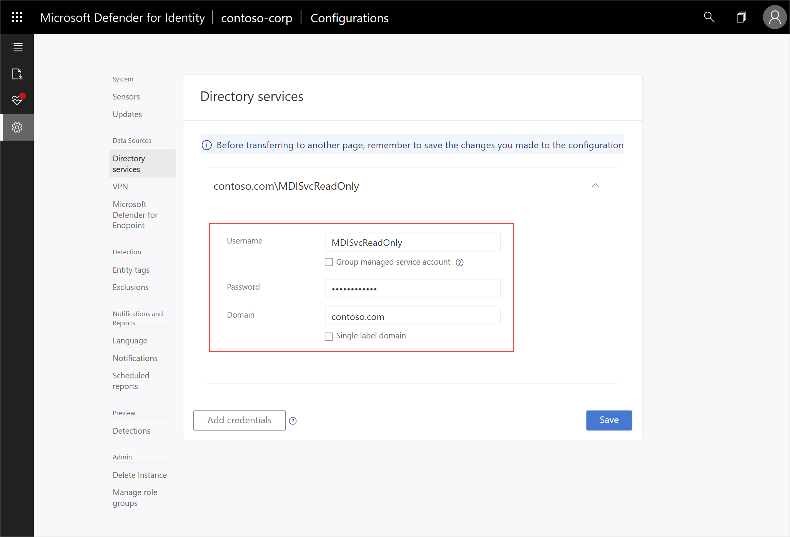

---
# required metadata

title: Change Azure Advanced Threat Protection config - domain connectivity password
description: Describes how to change the Domain Connectivity Password on the Azure ATP standalone sensor.
keywords:
author: shsagir
ms.author: shsagir
manager: shsagir
ms.date: 02/19/2020
ms.topic: conceptual
ms.collection: M365-security-compliance
ms.service: azure-advanced-threat-protection
ms.assetid: e7f065fa-1ad1-4e87-bd80-99cc695efbf5

# optional metadata

#ROBOTS:
#audience:
#ms.devlang:
ms.reviewer: itargoet
ms.suite: ems
#ms.tgt_pltfrm:
#ms.custom:

---

# Change Azure ATP portal configuration - domain connectivity password

## Change the domain connectivity password

If you need to modify the Domain Connectivity Password, make sure that the password you enter is correct. If it is not, the Azure ATP sensor service stops for all deployed sensors.

If you suspect that this happened, look at the Microsoft.Tri.sensor-Errors.log file for the following errors:
`The supplied credential is invalid.`

Follow this procedure to update the Domain Connectivity password on the Azure ATP portal:

> [!NOTE]
> This is the user name and password from the Active Directory on-premises deployment and not from Azure AD.

1. Open the Azure ATP portal by accessing the portal URL.

1. Select the settings option on the toolbar and select **Configuration**.

    

1. Select **Directory Services**.

    

1. Under **Password**, change the password.

    > [!NOTE]
    > Enter an Active Directory user and password here, not Azure Active Directory.

1. Click **Save**.

1. In the Azure ATP portal, under **Configuration**, go to the **Sensor** page and check the status of the sensors.

## See Also

- [Integration with Microsoft Defender ATP](integrate-wd-atp.md)
- [Check out the Azure ATP forum!](https://aka.ms/azureatpcommunity)
