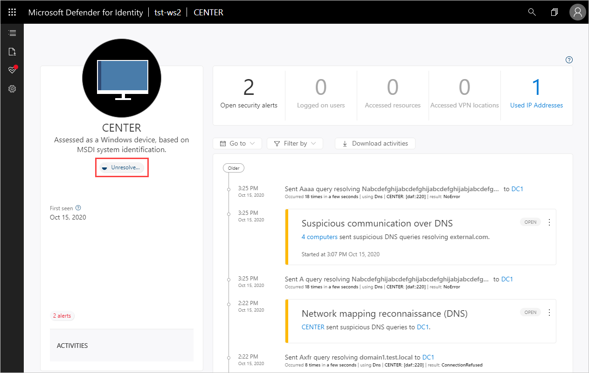
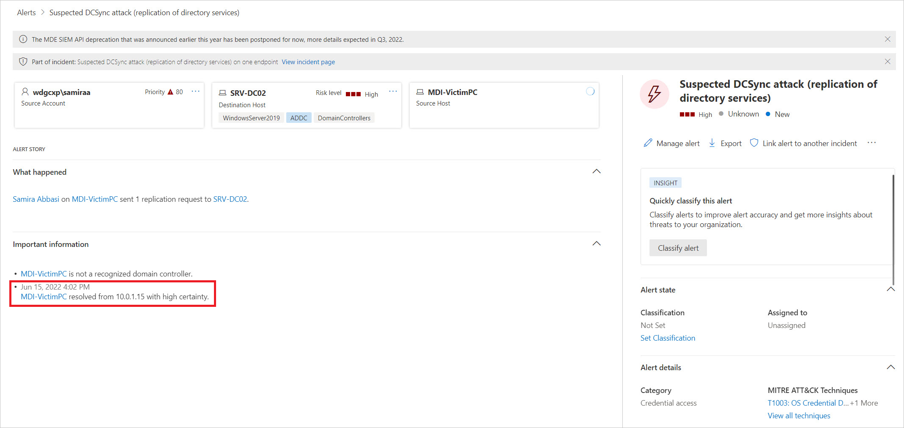

# What is Network Name Resolution?

> [!NOTE]
> The experience described in this page can be accessed at <https://security.microsoft.com> as part of Microsoft 365 Defender.

Network Name Resolution (NNR) is a main component of  [!INCLUDE [Product long](includes/product-long.md)] functionality. [!INCLUDE [Product short](includes/product-short.md)] captures activities based on network traffic, Windows events, and ETW - these activities normally contain IP data.

Using NNR, [!INCLUDE [Product short](includes/product-short.md)] can correlate between raw activities (containing IP addresses), and the relevant computers involved in each activity. Based on the raw activities, [!INCLUDE [Product short](includes/product-short.md)] profiles entities, including computers, and generates security alerts for suspicious activities.

To resolve IP addresses to computer names, [!INCLUDE [Product short](includes/product-short.md)] sensors look up the IP addresses using the following methods:

Primary methods:
- NTLM over RPC (TCP Port 135)
- NetBIOS (UDP port 137)
- RDP (TCP port 3389) - only the first packet of **Client hello**

Secondary method:
- Queries the DNS server using reverse DNS lookup of the IP address (UDP 53)

For the best results, we recommend using at least one of the primary methods. 
Reverse DNS lookup of the IP address is only performed when:
- There is no response from any of the primary methods. 
- There is a conflict in the response received from two or more primary methods. 

> [!NOTE]
> No authentication is performed on any of the ports.

[!INCLUDE [Product short](includes/product-short.md)] evaluates and determines the device operating system based on network traffic. After retrieving the computer name, the [!INCLUDE [Product short](includes/product-short.md)] sensor checks Active Directory and uses TCP fingerprints to see if there's a correlated computer object with the same computer name. Using TCP fingerprints helps identify unregistered and non-Windows devices, aiding in your investigation process.
When the [!INCLUDE [Product short](includes/product-short.md)] sensor finds the correlation, the sensor associates the IP to the computer object.

In cases where no name is retrieved, an **unresolved computer profile by IP** is created with the IP and the relevant detected activity.

NNR data is crucial for detecting the following threats:

- Suspected identity theft (pass-the-ticket)
- Suspected DCSync attack (replication of directory services)
- Network mapping reconnaissance (DNS)

To improve your ability to determine if an alert is a **True Positive (TP)** or **False Positive (FP)**, [!INCLUDE [Product short](includes/product-short.md)] includes the degree of certainty of computer naming resolving into the evidence of each security alert.

For example, when computer names are resolved with  **high certainty** it increases the confidence in the resulting security alert as a **True Positive** or **TP**.

The evidence includes the time, IP, and computer name the IP was resolved to. When the resolution certainty is **low**, use this information to investigate and verify which device was the true source of the IP at this time.
After confirming the device, you can then determine if the alert is a **False Positive** or **FP**, similar to the following examples:

- Suspected identity theft (pass-the-ticket) – the alert was triggered for the same computer.
- Suspected DCSync attack (replication of directory services) – the alert was triggered from a domain controller.
- Network mapping reconnaissance (DNS) – the alert was triggered from a DNS Server.

    

## Prerequisites

|Protocol|Transport|Port|Device|Direction|
|--------|--------|------|-------|------|
|NTLM over RPC*|TCP|135|All devices on the network|Inbound|
|NetBIOS*|UDP|137|All devices on the network|Inbound|
|RDP*|TCP|3389|All devices on the network|Inbound|
|DNS|UDP|53|Domain controllers|Outbound|

\* One of these methods is required, but we recommend using all of them.

To make sure [!INCLUDE [Product short](includes/product-short.md)] is working ideally and the environment is configured correctly, [!INCLUDE [Product short](includes/product-short.md)] checks the resolution status of each Sensor and issues a health alert per method, providing a list of the [!INCLUDE [Product short](includes/product-short.md)] sensors with low success rate of active name resolution using each method.

> [!NOTE]
> To disable an optional NNR method in [!INCLUDE [Product short](includes/product-short.md)] to fit the needs of your environment, open a support call.

Each health alert provides specific details of the method, sensors, the problematic policy as well as configuration recommendations.

## Configuration recommendations

- NTLM over RPC:
  - Check that TCP Port 135 is open for inbound communication from [!INCLUDE [Product short](includes/product-short.md)] Sensors, on all computers in the environment.
  - Check all network configuration (firewalls), as this can prevent communication to the relevant ports.

- NetBIOS:
  - Check that UDP Port 137 is open for inbound communication from [!INCLUDE [Product short](includes/product-short.md)] Sensors, on all computers in the environment.
  - Check all network configuration (firewalls), as this can prevent communication to the relevant ports.
- RDP:
  - Check that TCP Port 3389 is open for inbound communication from [!INCLUDE [Product short](includes/product-short.md)] Sensors, on all computers in the environment.
  - Check all network configuration (firewalls), as this can prevent communication to the relevant ports.
  >[!NOTE]
  >Customized RDP ports aren't supported.
- Reverse DNS:
  - Check that the Sensor can reach the DNS server and that Reverse Lookup Zones are enabled.

## See Also

- [[!INCLUDE [Product short](includes/product-short.md)] prerequisites](prerequisites.md)
- [Configure event collection](configure-event-collection.md)
- [Check out the [!INCLUDE [Product short](includes/product-short.md)] forum!](<https://aka.ms/MDIcommunity>)
