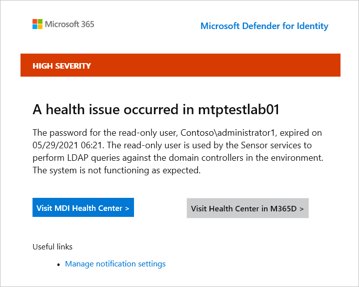
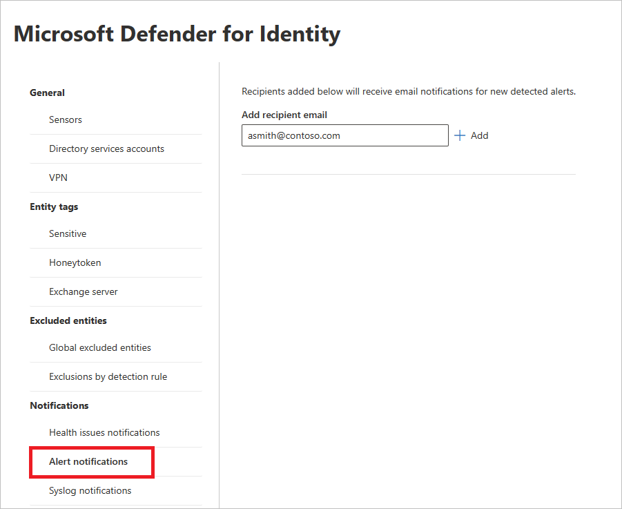
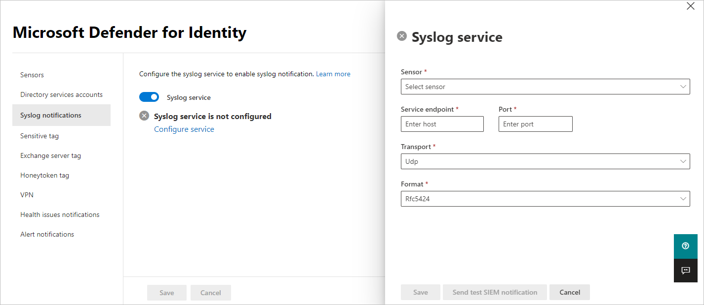

# Defender for Identity notifications in Microsoft 365 Defender

This article explains how to work with Microsoft Defender for Identity notifications in Microsoft 365 Defender.

## Health issues notifications

In Microsoft 365 Defender, you can add recipients for email notifications of health issues in Defender for Identity.

1. In [Microsoft 365 Defender](https://security.microsoft.com), go to **Settings** and then **Identities**.

    

1. Select **Health issues notifications**.

1. Enter the recipient's email address. Select **Add**.

    

1. When Defender for Identity detects a health issue, the recipients will receive an email notification with the details.

    

    > [!NOTE]
    > The email provides two links for further details about the issue. You can either go to the **MDI Health Center** or the new **Health Center in M365D**.

## Alert notifications

In Microsoft 365 Defender, you can add recipients for email notifications of detected alerts.

1. In [Microsoft 365 Defender](https://security.microsoft.com), go to **Settings** and then **Identities**.

    

1. Select **Alert notifications**.

1. Enter the recipient's email address. Select **Add**.

    

## Syslog notifications

Defender for Identity can notify you when it detects suspicious activities by sending security and health alerts to your Syslog server through a nominated sensor.

> [!NOTE]
> To learn how to integrate Defender for Identity with Microsoft Sentinel, see [Microsoft 365 Defender integration with Microsoft Sentinel](/azure/sentinel/microsoft-365-defender-sentinel-integration).

1. In [Microsoft 365 Defender](https://security.microsoft.com), go to **Settings** and then **Identities**.

    

1. Select **Syslog notifications**.

1. To enable syslog notification, set the **Syslog service** toggle to the **on** position.

    

1. Select **Configure service**. A pane will open where you can enter the details for the syslog service.

    

1. Enter the following details:

    - **Sensor** - From the drop-down list, choose the sensor that will send the alerts.
    - **Service endpoint** and **Port** - Enter the IP address or fully qualified domain name (FQDN) for the syslog server and specify the port number. You can configure only one Syslog endpoint.
    - **Transport** - Select the **Transport** protocol (TCP or UDP).
    - **Format** - Select the format (RFC 3164 or RFC 5424).

1. Select **Send test SIEM notification** and then verify the message is received in your Syslog infrastructure solution.

1. Select **Save**.

1. Once you've configured the **Syslog service**, you can choose which types of notifications (alerts or health issues) to send to your Syslog server.

    

> [!NOTE]
>
> - If you plan to create automation or scripts for [!INCLUDE [Product short](includes/product-short.md)] SIEM logs, we recommend using the **externalId** field to identify the alert type instead of using the alert name for this purpose. Alert names may occasionally be modified, while the **externalId** of each alert is permanent. For more information, see [[!INCLUDE [Product short](includes/product-short.md)] SIEM log reference](cef-format-sa.md).
>
> - When working with Syslog in TLS mode, make sure to install the required certificates on the designated sensor.
>
> - The events won’t be sent from the Defender for Identity service to your Syslog server directly. This is the purpose of the nominated sensor. The selected sensor will collect the data from the Defender for Identity service and send it to your Syslog server.

## See Also

- [Configure event collection](configure-event-collection.md)
- [Check out the [!INCLUDE [Product short](includes/product-short.md)] forum!](<https://aka.ms/MDIcommunity>)
