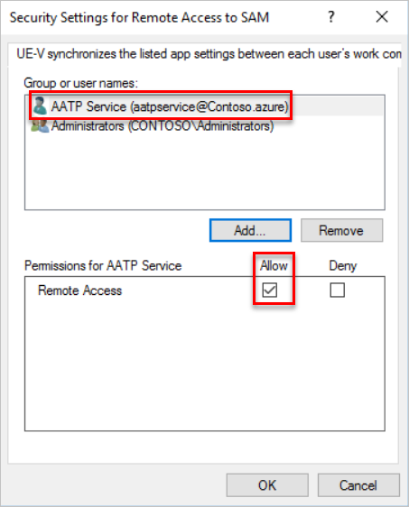
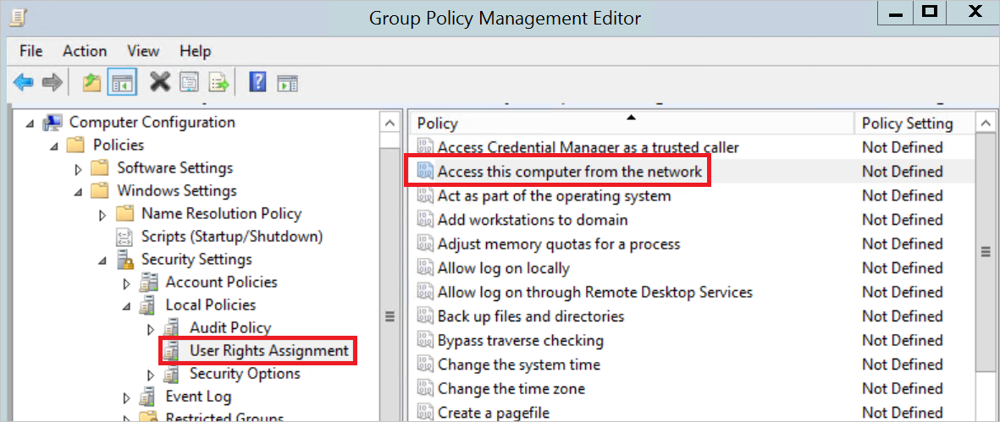
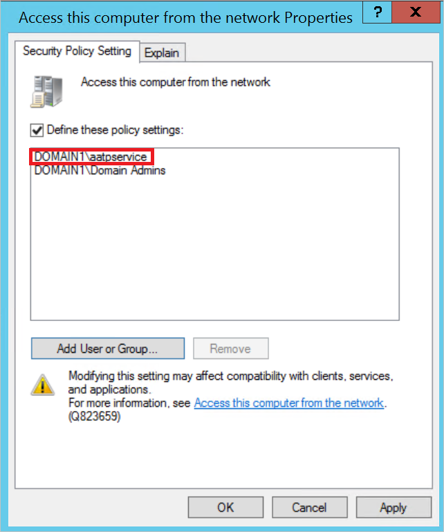

# Configure SAM-R to enable lateral movement path detection in Microsoft Defender for Identity

[!INCLUDE [Product long](includes/product-long.md)] [lateral movement path](/defender-for-identity/understand-lateral-movement-paths) detection relies on queries that identify local admins on specific machines. These queries are performed with the SAM-R protocol, using the [!INCLUDE [Product short](includes/product-short.md)] [Directory Service account](directory-service-accounts.md) you configured.

## Configure SAM-R required permissions

To ensure Windows clients and servers allow your [!INCLUDE [Product short](includes/product-short.md)] Directory Service account to perform SAM-R, a modification to **Group Policy** must be made to add the [!INCLUDE [Product short](includes/product-short.md)] Directory Service account in addition to the configured accounts listed in the **Network access** policy. Make sure to apply group policies to all computers **except domain controllers**.

> [!NOTE]
> Before enforcing new policies such as this one, it is critical to make sure that your environment remains secure, and any changes will not impact your application compatibility. Do this by first enabling and then verifying the compatibility of proposed changes in audit mode before making changes to your production environment. You may observe increased SAM-R traffic, generated by the Defender for Identity sensors.

1. Locate the policy:

   - Policy Name: Network access - Restrict clients allowed to make remote calls to SAM
   - Location: Computer configuration, Windows settings, Security settings, Local policies, Security options

    

1. Add the [!INCLUDE [Product short](includes/product-short.md)] Directory Service account to the list of approved accounts able to perform this action on your modern Windows systems.

    

1. The [!INCLUDE [Product short](includes/product-short.md)] Directory Service account now has the privileges needed to perform SAM-R in the environment.

For more on SAM-R and this Group Policy, see [Network access: Restrict clients allowed to make remote calls to SAM](/windows/security/threat-protection/security-policy-settings/network-access-restrict-clients-allowed-to-make-remote-sam-calls).

### Access this computer from the network setting

If you've defined the [Access this computer from the network](/windows/security/threat-protection/security-policy-settings/access-this-computer-from-the-network) setting in any GPO that applies to computers in your domain, you need to add the Defender for Identity Directory Service account to the list of allowed accounts for that setting:

> [!NOTE]
> The setting is not enabled by default. If you have not enabled it previously, you don't need to modify it to allow Defender for Identity to make remote calls to SAM.

To add the Directory Service account, go to the policy and navigate to **Computer Configuration** -> **Policies** -> **Windows Settings** -> **Local Policies** -> **User Right Assignment**. Then open the setting **Access this computer from the network**.

Then add the [!INCLUDE [Product short](includes/product-short.md)] Directory Service account to the list of approved accounts.

>[!NOTE]
> In the Microsoft recommended baselines, as part of the [Microsoft Security Compliance Toolkit](https://www.microsoft.com/en-us/download/details.aspx?id=55319), we recommend replacing the default *Everyone* with *Authenticated Users* to prevent anonymous connection from performing network logons. Please review the local policy settings before managing this setting from a GPO, and consider including *Authenticated Users* in the GPO if needed.

## Next steps

> [!div class="step-by-step"]
> [« Role groups](role-groups.md)
> [Download the Defender for Identity sensor »](download-sensor.md)
