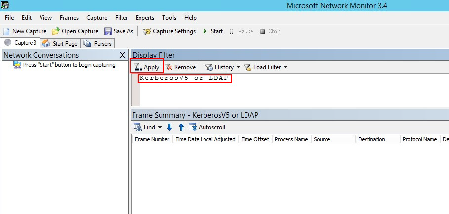

---
# required metadata
title: Validate port mirroring in Microsoft Defender for Identity
description: Describes how to validate that port mirroring is configured correctly in Microsoft Defender for Identity
keywords:
author: shsagir
ms.author: shsagir
manager: shsagir
ms.date: 10/27/2020
ms.topic: how-to
ms.collection: M365-security-compliance
ms.service: azure-advanced-threat-protection

# optional metadata
ms.reviewer: bennyl
ms.suite: ems
---

# Validate Port Mirroring

This article is relevant only if you deploy deploy [!INCLUDE [Product long](includes/product-long.md)] Standalone Sensor instead of [!INCLUDE [Product short](includes/product-short.md)] Sensor.

> [!NOTE]
> [!INCLUDE [Product short](includes/product-short.md)] standalone sensors do not support the collection of Event Tracing for Windows (ETW) log entries that provide the data for multiple detections. For full coverage of your environment, we recommend deploying the [!INCLUDE [Product short](includes/product-short.md)] sensor.

The following steps walk you through the process for validating that port mirroring is properly configured. For [!INCLUDE [Product short](includes/product-short.md)] to work properly, the [!INCLUDE [Product short](includes/product-short.md)] standalone sensor must be able to see the traffic to and from the domain controller. The main data source used by [!INCLUDE [Product short](includes/product-short.md)] is deep packet inspection of the network traffic to and from your domain controllers. For [!INCLUDE [Product short](includes/product-short.md)] to see the network traffic, port mirroring needs to be configured. Port mirroring copies the traffic from one port (the source port) to another port (the destination port).

## Validate port mirroring using Net Mon

1. Install [Microsoft Network Monitor 3.4](https://www.microsoft.com/download/details.aspx?id=4865) on the [!INCLUDE [Product short](includes/product-short.md)] standalone sensor that you want to validate.

    > [!IMPORTANT]
    > If you choose to install Wireshark in order to validate port mirroring, restart the [!INCLUDE [Product short](includes/product-short.md)] standalone sensor service after validation.

1. Open Network Monitor and create a new capture tab.

    1. Select only the **Capture** network adapter or the network adapter that is connected to the switch port that is configured as the port mirroring destination.

    1. Ensure that P-Mode is enabled.

    1. Click **New Capture**.

        

1. In the Display Filter window, enter the following filter: **KerberosV5 OR LDAP** and then click **Apply**.

    

1. Click **Start** to start the capture session. If you do not see traffic to and from the domain controller, review your port mirroring configuration.

    

    > [!NOTE]
    > It is important to make sure you see traffic to and from the domain controllers.

1. If you only see traffic in one direction, work with your networking or virtualization teams to help troubleshoot your port mirroring configuration.

## See Also

- [Configure event forwarding](configure-event-forwarding.md)
- [Configure port mirroring](configure-port-mirroring.md)
- [Check out the [!INCLUDE [Product short](includes/product-short.md)] forum!](https://aka.ms/MDIcommunity)
